# Projects

## **What is a project?**

Projects are used to manage the visualization elements of the **VC Hub** system, and through multi-project management, it is possible to clearly differentiate between the presentation and design of configuration screens in several industrial application scenarios. In a project, **configuration controls**, **tag** **s** and **scripts** allow the user to freely configure a variety of digital visualization interfaces in order to cope with different industrial production scenarios.

In the VC Hub system, the project is a configuration unit that contains:

- 2D Configuration: A rich graphical configuration editor.
- 3D Configuration: A three-dimensional graphical configuration editor, which, once configured, can be displayed on the screen by means of the 3D controls in the **2D Configuration**.

In a single project, multiple configuration pages can be managed at the same time, the project can be seen as a folder of multiple related configuration screens. Through this mechanism, in an industrial generation environment with relatively more scenes, users can create multiple projects, each managing a production scene in the project, and a production scene consists of multiple screens to achieve the goal of clear management of configuration screens, and to make the later maintenance easier.

For example, there is a large factory with 10 production plants.

Under the project management mechanism, you can create a project called "Factory", which contains general information about the factory production and overview controls and data of the 10 workshops.

At the same time, you can create a project called "Factory", which contains general information about the production of the factory and an overview of the 10 workshops, as well as data for each of the 10 workshops.

Through the screen jump function in the configuration, the workshop controls in the overview screen of the "Factory" and the screens in each workshop project are associated to realize the multi-level management of the production environment.

## **How to use**

After successfully logging in to the system, users will be taken to the project list page, where they can manage their projects.

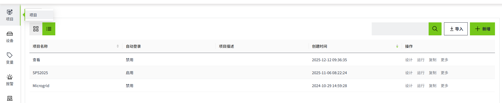

**There are two Auto Login status shown in the project list: Enabled, and Disabled.**

- **Enabled**: The auto login feature has been turned on in the project configuration window within the editor.
- **Disabled**: The auto-login feature for the project is disabled. If the project was added to the project list via import, a special icon will be displayed next to the "Disabled" status.

**Project Configuration Window**:

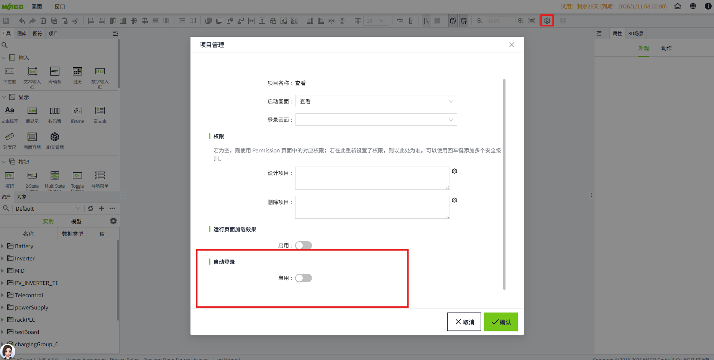

Projects are presented in both lists and charts, which are switched via the icon in the upper left corner.Default list mode.

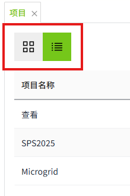

| Icon        |  Description   |                                                                                                                                                                                                                                                                                                                                                                                                         
|---------------------------------------------------------------------------------------------------------------------------------------------------------------------------------------------------------------------------------------|-------------------------------------------------------------------------------------------------------------------------------------------------------------------------------------------------------------------------------------------------------------------|
| 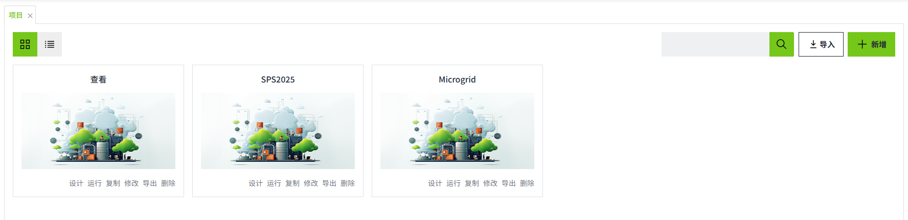| Use chart mode to display.   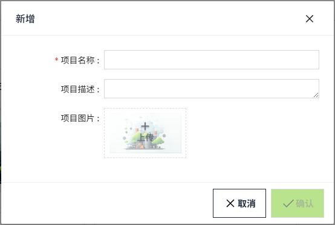|
| 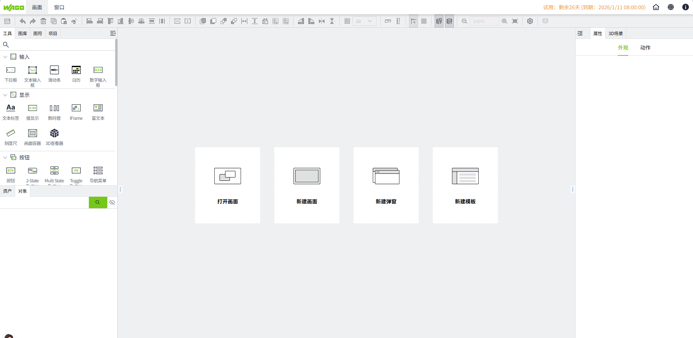| Use list mode to display.   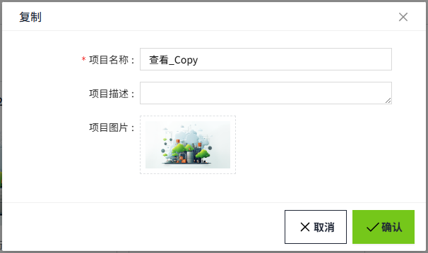|

#### **Query**

Users in the main page of the project, you can view all the projects in the current system, the default **creation time** in reverse order, users can customize the order, currently only supports**, creation time, name** of the reverse order of the positive order of the arrangement.

Users can switch the factory to display in list or arrangement mode through the button on the upper left corner, the default is to display in list mode, after clicking the arrangement mode on the left side, as shown in the figure below, only the project name and project picture are displayed.

Users can input the keywords of the **project name** through the input box at the upper right corner to filter out the projects to be displayed by fuzzy filtering.

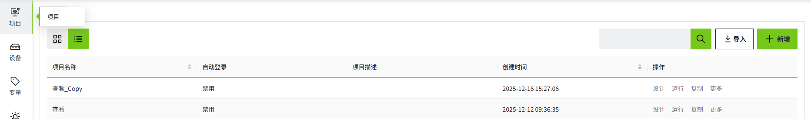

#### **Add**

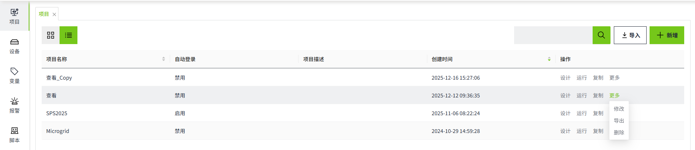

Users can create a new project by clicking on the Add button in the upper right corner button and entering the basic information of the project.

| **Configuration**   | **Description**                                                                                                                                                                                                                      |
|---------------------|--------------------------------------------------------------------------------------------------------------------------------------------------------------------------------------------------------------------------------------|
| Project Name        | The name of the project, the name cannot be repeated, required.                                                                                                                                                                      |
| Project Description | The description of the project, optional.                                                                                                                                                                                            |
| Project Image       | The image that will be displayed when the project is arranged, only JPG, GIF, PNG, SVG, JPEG format is supported. Optional. If no customized image is uploaded, the default image will be displayed, as shown in the query function. |

#### **Design**

Select any project and click Design button to open the project design page.

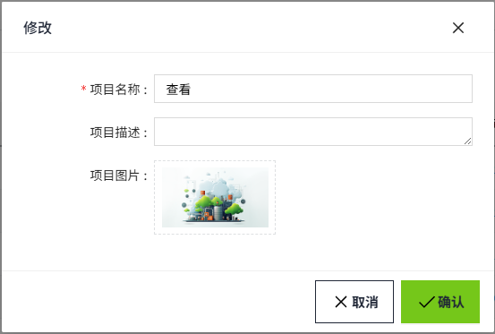

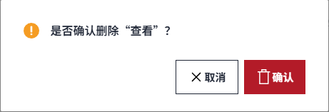

Please refer to: 2D Configuration, 3D Configuration, Assets and Tags for specific function introduction of the design page.

#### **Run**

Select any project and click the **Run** button to open the project **startup page.**

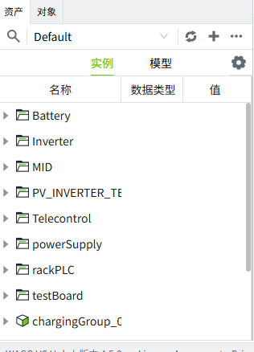

The **startup page** can be set in the “Project Configuration” window of the 2D Designer.

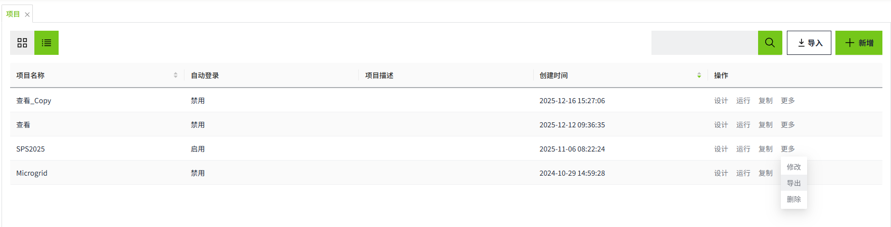

#### **Copy**

Select any project, click **Copy** button , an edit box will pop up, the default name of the copied project is "{original project name}_Copy", users can modify the name, description and project picture according to requirements.

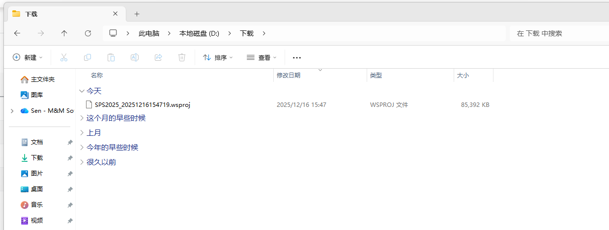

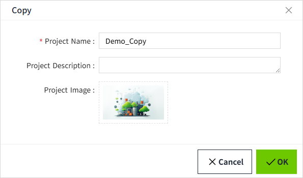

Click  the “OK “  button to complete the copy.

#### **Edit**

The user can move the mouse over any of the Project **More** buttons, which will display more drop-down menu options.

After the user clicks on the drop-down menu **Edit** button, the project base information edit box will pop up, modify it as needed and click **OK** to modify the project base information.

#### **Delete**

After the user clicks on the drop-down menu Delete button, a Delete prompt box will pop up, click on OK to delete the selected item. Message.

#### **Export**

 Users can move their mouse over any of the project "More" buttons to reveal more drop-down menu options.

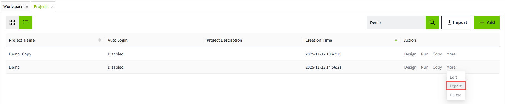

 After the user clicks on **Export** , the selected items can be exported to a  wsproj  file, which can be used for project backup.

#### **Import**

Users can click the Import button in the upper right corner to import the previously exported file, which will be imported with the file name of the wsproj file as the name of the project, and the time of import will be added after the file name as the name of the imported project.

## **Asset Window in Project**

In the Project Designer, users can view and edit the asset model and asset instances in the asset list in the lower left corner, but the special thing is that the asset data doesn't belong to a single project, for example, if the user has added the tag n in Project A, the tag will be equally visible in Project B and you can use it.

**Note**: Asset data does not belong to the project, the asset exists independently in the system, and there is only a usage relationship between the project and the asset.

