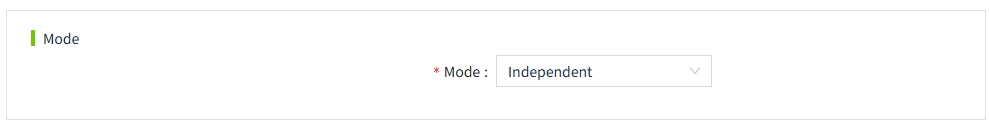
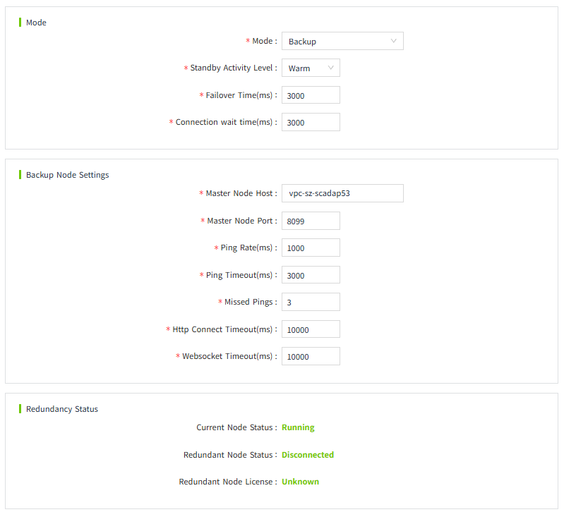
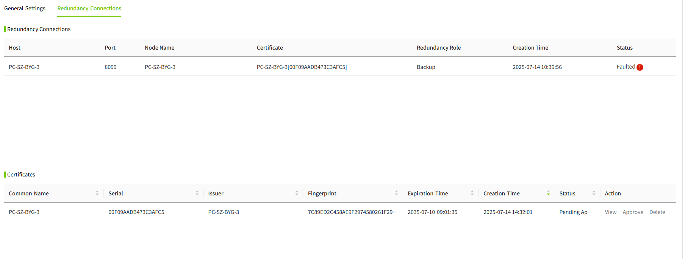

# Configuration Redundancy

In the "Networking"->"Redundancy" page, configure redundancy.

***When the redundant node is running, it needs to load the same configuration data of the master node, so you need to import the project of the master node to the backup node before configuring redundancy.***

You need to pay attention to the following 3 points when configuring redundancy:

1. All devices, databases, and networking nodes configured on the master node should be accessible on the backup node. Avoid using localhost when configuring the network address, because the actual address of localhost on the master and backup nodes is different.
2. The firewall of the server on the master node needs to open port **8099**, which can be modified in the network configuration page.
3. You need to modify the node name on the standby node, the node name and the master node to maintain the same, if the standby node to import the master node's project contains the master node's system configuration can be ignored this step.

There are three modes: Independent, Master, Backup.

- **Independent**: Redundancy is not enabled. This node operates as a standalone server.
- **Master**: Operates as the primary server, running all backend tasks by default and responding to heartbeat signals from the backup server.
- **Backup**:Operates as the backup server, periodically sending heartbeat signals to the primary server. If the primary server is detected to be down, the backup server will take over its operations.

## Independent** Mode**

## **Master Server**

## **Backup Server**

| **Mode Setting**            |                                                                                                                                                                                                                                                                                                                                                    |
|-------------------------------|----------------------------------------------------------------------------------------------------------------------------------------------------------------------------------------------------------------------------------------------------------------------------------------------------------------------------------------------------|
| Mode                          | Selects the mode of the current server. Includes Independent, Master, and Backup.                                                                                                                                                                                                                                                                  |
| Standby Activity Level        | Contains cold and warm. If cold standby, no data collection is performed. If warm standby, performs number acquisition, but does not process the data.                                                                                                                                                                                             |
| Failover Time(ms)             | The duration in milliseconds of a failure before the standby node takes over the workload of the master node.                                                                                                                                                                                                                                      |
| Connection wait time(ms)      | When the master node starts up can not directly determine the running state, because there may be running spare nodes, the master node will wait for the spare node to connect up, if timeout this configured time, the master node will ignore the existence of the spare node directly set its own running state to Running, unit milliseconds . |
| **Master Node Configuration** |                                                                                                                                                                                                                                                                                                                                                    |
| Recovery Mode                 | There are two types of recovery modes: Manual and Automatic, and the default is Automatic. When the master node starts up, if the recovery mode is automatic, the master node will ignore the current running state of that backup node and directly set the running state to Running.                                                             |
| **Backup Node Configuration** |                                                                                                                                                                                                                                                                                                                                                    |
| Master Node Host              | The network address of the master server.                                                                                                                                                                                                                                                                                                          |
| Master Node Port              | The network listening port of the master server, which can be modified in the network configuration page of the master server.                                                                                                                                                                                                                     |
| Ping Rate(ms)                 | How often the master and backup nodes send heartbeats, in milliseconds.                                                                                                                                                                                                                                                                            |
| Ping Timeout(ms)              | The timeout for heartbeats of the master and backup nodes, in milliseconds.                                                                                                                                                                                                                                                                        |
| Missed Pings                  | When the number of consecutive heartbeat failures exceeds the maximum number, the system determines that the redundant node is not available.                                                                                                                                                                                                      |
| Http Connect Timeout(ms)      | The connection timeout for http requests sent by the primary and backup nodes, in milliseconds.                                                                                                                                                                                                                                                    |
| Websocket Timeout(ms)         | The timeout for the master node to establish a websocket connection, in milliseconds.                                                                                                                                                                                                                                                              |
| **Redundancy Status**         |                                                                                                                                                                                                                                                                                                                                                    |
| Current Node Status           | The operational status of the current node.                                                                                                                                                                                                                                                                                                        |
| Redundant Node Status         | The operational status of the redundant node.                                                                                                                                                                                                                                                                                                      |
| Redundant Node License        | Displays whether the authorization modules for the licenses of the master and backup nodes are the same.                                                                                                                                                                                                                                           |

## **Configuring Redundancy**

#### Configure Node Redundancy Mode

**Master Server**

1. On the "Networking"-> "Redundancy" page, select Master for the mode.
2. Set the following parameters.

- Standby Activity Level: Warm
- Failover Time(ms): 10000
- Connection wait time(ms): 10000
- Recovery Mode: Manual

3. Click the "OK" button to save the settings.

**Backup Server**

1. On the "Networking" -> "Redundancy" page, select Backup for the mode.
2. Set the following parameters.

- Master Node Host: The machine name or IP address of the primary server.
- Master Node Port: Port of the primary server
- Use SSL: Enable
- Ping Rate(ms): 1000
- Ping Timeout(ms): 3000
- Missed Pings: 3
- Http Connect Timeout(ms): 10000
- Websocket Timeout(ms): 10000

3. Click the "OK" button to save the settings.
4. Check the redundancy status of the master and backup servers.

The redundancy status displayed on the master server is as follows:

- Current Node Status: Running
- Redundant Node Status: Standby
- Redundant Node License: Match

The redundancy status displayed on the backup server is as follows:

- Current Node Status: Standby
- Redundant Node Status: Running
- Redundant Node License: Match     

######  Trust the Peer Node's Certificate

After completing the general configuration for master and backup nodes, the redundancy is not yet established. 

You must first trust the peer node’s certificate by following these steps:

1. On the backup node, go to the **Redundancy Connections** page. In the redundancy connection list, the master node's status will appear as **Faulted**.  In the certificates list, click the “Approve" button to trust it.

2. At this point, on the **Redundancy Connections** page of the master node, the certificate list will display the backup node's certificate. Click the “Approve" button to trust the backup node's certificate.

3. After approving the backup node’s certificate, the redundancy connection list on the master node will display the backup node’s information.

4. Click the “Approve" button to complete the redundancy setup.

#### View Redundancy Status

On the **Master Server**, the redundancy status is displayed as:

- Current Node Status: Running
- Redundant Node Status: Standby
- Redundant Node License: Match

On the **Backup Server**, the redundancy status is displayed as:

- Current Node Status: Standby
- Redundant Node Status: Running
- Redundant Node License: Match

## Notes

1. Redundancy and networking share the same port. Therefore, networking must be enabled when configuring redundancy.
2. Historical data is stored based on the node name. After setting up redundancy between two nodes, the node name of the backup server must be changed to match the master server. Otherwise, the backup server will not be able to access historical data synchronized from the master node.