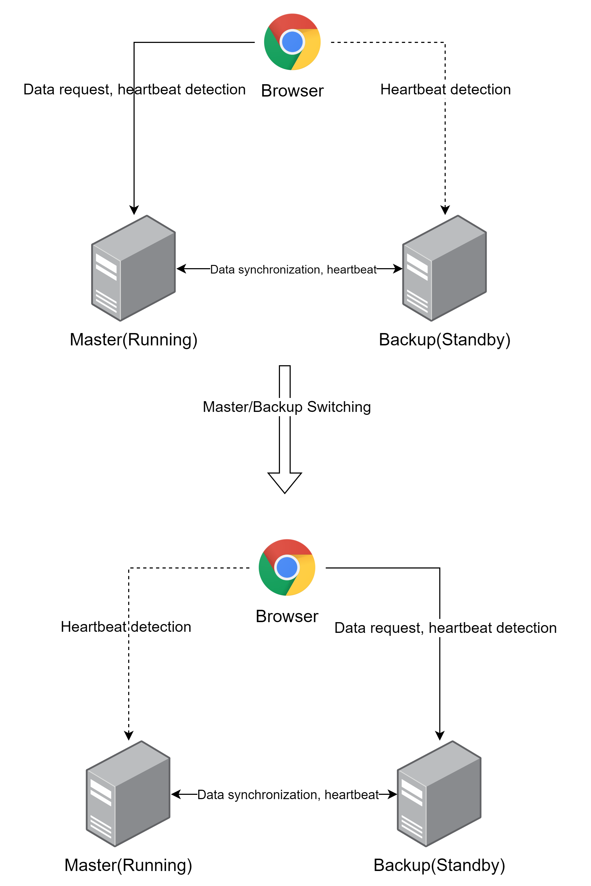

# Automatic switch between master and backup server on the runnin​

If a browser opens the configuration screen after a redundant node has been configured, the configuration screen checks the operating status of the current node and the redundant node and issues a heartbeat packet to both nodes. If the running status of the current node is Standby and the running status of the redundant node is Running, the current running screen will trigger a master/standby switchover, and the address of the real-time screen will be switched to the address of the redundant node automatically.

The following is the scenes that will trigger the screen to switch between master and backup.

| **Current node type** | **Master node status**      | **Standby node status**        | **Trigger screen switchover** |
|-----------------------|----------------------------------------|-------------------------------------------|-------------------------------|
| Master node           | Standby or no heartbeat response       | Running and heartbeat responding normally | Yes                           |
| Master node           | Running with normal heartbeat response | Standby or no heartbeat response          | No                            |
| Backup node           | Standby or no heartbeat response       | Running and heartbeat responding normally | No                            |
| Backup node           | Running with normal heartbeat response | Standby or no heartbeat response          | Yes                           |

#### Master and backup page switch address configuration

The public address of the redundant node will be prioritized for jumping when the real-time screen is switched between master and standby. The public address can be configured in "Networking"->"Node Settings" page. 

If the public address is configured, the public address will be prioritized for jumping during the master/standby switchover. If the public address is not configured, the master node address in the redundant configuration or the remote IP address of the redundant connection will be used for jumping.

#### **Scenarios for Master-Backup Switchover**

###### **Scenario 1: No public address is configured, and the address of the currently running server is used as the URL after the switchover when the master and backup are switched over.**

1. Server A serves as the primary server with the address `http://pc-test-serverA:8060`
2. Server B serves as the primary server, and the address is `http://pc-test-serverB:8060`.
3. Server A and Server B form a redundancy
4. View the SCADA operation screen on Server A. At this time, Server A is down, Server B is running, and the address of the operation screen is displayed as `http://pc-test-serverB:8060`

###### **Scenario 2: A public address is configured, and when the master and backup are switched over, the public address set by the current running node is used as the URL after the switchover.**

1. Server A acts as the master server, and the address is `http://pc-test-serverA:8060`
2. Server B acts as the master server with the address `http://pc-test-serverB:8060`
3. Server A and Server B form redundancy
4. The public address of Server A and Server B is set to `https://testserver.com:8066`
5. View the SCADA operation screen on Server A. At this time, Server A is down, Server B is running, and the address of the operation screen is displayed as `https://testserver.com:8066`.

