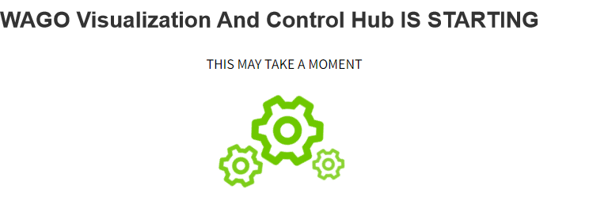

# Redundant configuration synchronization

Before two VC Hub nodes are configured for redundancy, you need to make sure that the engineering data, network configuration and node names on both nodes are consistent. We can export the project in the project management page of the master node and then import it to the backup node.

You can set a password for the exported file.

Then in the workspace page of the backup node, click the "Import" button to import the file exported from the master node, and you will be prompted whether to overwrite the node configuration, redundancy and network information.

It is recommended to choose "Replace" to ensure that the configuration of the master and the backup is consistent. 

After the replace operation is completed, you will enter the startup page.

After the startup operation is completed, you will enter the login page and use the user name of the master node to login. After logging in, you will find that all the data and configurations on the backup node are the same as those on the master node. 

