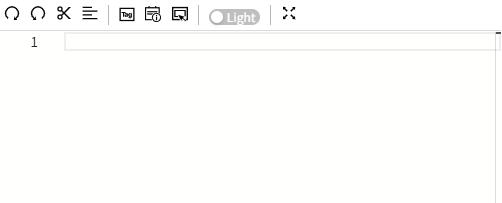

# Scripts

## **What is script?**

Most of the time, when we talk about "scripts" in VC Hub, we mainly refer to JavaScript (JS). JavaScript ("JS") is a function-first, lightweight, interpreted or just-in-time compiled programming language. Although it is known as a scripting language for developing web pages, it is also used in many non-browser environments. JavaScript is based on prototypical programming, a multi-paradigm dynamic scripting language, and supports object-oriented, imperative, declarative, and functional programming paradigms.

In VC Hub, you will mix the core JS language with references to other components and various built-in system functions.

You can create various types of scripts under the "Scripts" menu. 

## Security of Script

In VC Hub, scripting is an advanced feature that offers maximum flexibility and convenience for complex configuration scenarios, such as performing intricate logical operations or handling local resources (e.g., reading and writing files). This openness, however, introduces potential security risks, such as a configuration engineer accidentally writing malicious code. Whatever, only legitimate users of VC Hub can write scripts in the system. Therefore, you can consider that VC Hub merely provides a scripting tool, and whether malicious code is written depends on the person writing the code, VC Hub itself does not control the script content. 

The scripting feature allows users to customize logic, data processing, event handling, and UI interactions, greatly enhancing the system’s flexibility and automation capabilities. However, if not properly managed, it may introduce serious security and operational risks. Therefore, we recommend:

1. Grant script editing permissions only to trusted users (via role-based access control).
2. Review all scripts before deployment to prevent malicious or erroneous code from being executed.
3. Do not grant script editing rights to guest accounts or low-privilege users.
4. Establish a formal review and approval workflow, and conduct regular audits to detect unauthorized script modifications.
5. Whenever possible, validate script behavior in a test environment before deploying to production.
6. Leverage AI-powered tools to assist in identifying potential security risks within scripts.

## **Is it easy to use?**

Fortunately, JS is a simple language to get started with. We provide a large number of functions in VC Hub that accomplish common tasks in a single line of code. These system functions are available at the time of typing. Just start with "System" and press "." to see the list of available functions. The list will filter itself as you continue typing.

## **Where are the scripts used?**

JS is used in many locations within VC Hub. Each location has its own events that trigger scripts to run and add functionality to the project in different ways.

The following are common usage scenarios:

- Controls: Add actions to controls such as buttons, customize the appearance of charts and tables, and even set up custom navigation architectures.
- Lifecycle: Trigger scripts to run when controls or screens are loaded/unloaded.
- Schedule: Execute scripts at regular intervals.
- Custom Functions: Allow users to define their own functions to be used as shortcut selections in scripts.

