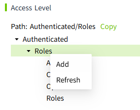
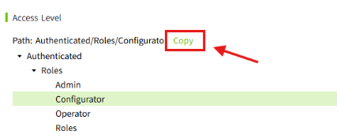

# Access Level

It is used to maintain and manage the Access Level of the platform. Click "Security" -> "Access Level" in the menu bar, and you can enter the Access Level configuration page. Users can flexibly configure the Access Level according to their needs.

By assigning different Access Levels, it is possible to precisely control whether users have the right to access specific resources.

**Note:** Roles added or deleted in the Access Level will not affect the role data in the "Role" list. They are independent of each other.

The Access Level is displayed in a tree structure in the system. By default, five levels are reserved.

- Authenticated
- Authenticated/Roles 
- Authenticated/Roles/Admin
- Authenticated/Roles/Configurator
- Authenticated/Roles/Operator

| **Levels**                       | **Description**                                                                                                                                                                                                                                                                                             |
|----------------------------------|-------------------------------------------------------------------------------------------------------------------------------------------------------------------------------------------------------------------------------------------------------------------------------------------------------------|
| Authenticated                    | By default, users who have successfully logged in are assigned the "Authenticated" access level.                                                                                                                                                                                                            |
| Authenticated/Roles              | You can add sub-levels under this level, but only one level of sub-levels can be added. For levels other than the "Authenticated/Roles" level, you can nest them to any depth according to your needs. These levels should correspond to the role names expected to be obtained from the Identity Provider. |
| Authenticated/Roles/Admin        | System built-in role.                                                                                                                                                                                                                                                                                       |
| Authenticated/Roles/Configurator | System built-in role.                                                                                                                                                                                                                                                                                       |
| Authenticated/Roles/Operator     | System built-in role.                                                                                                                                                                                                                                                                                       |

## Customize Access Level

It supports users to perform operations of adding, modifying and deleting Access Levels according to their needs.

**Note:**  

1. The Access Level will only be truly saved after you click the "Save" button.
2. Clicking the "Cancel" button will restore the content to the last saved version.

## Add Access Level

It supports users to create their own Access Level.

1. Right-click on the parent level where you need to add a new Access Level to open the drop-down menu.

    

2. Click the "Add" button to open the add pop-up window.
3. Enter the name and description of the newly added Access Level.

    

4. Click the "OK" button in the pop-up window, and the new level will be inserted into the first level under the currently selected level.
5. Click the "Save" button on the page to save the modified content.

**Note:**  

1. When adding a new Access Level, if there is already an Access Level with the same name (case-insensitive) at the same level, the addition operation will fail. 
2. Access Levels at different levels can have the same name. 
3. The "Authenticated/Roles" level only supports one level of sub-levels. For levels other than the "Authenticated/Roles" level, you can add sub-levels with any number of tiers according to your needs. 

## Refresh Access Level

The refresh operation is only supported at the "Authenticated/Roles" level. This will synchronize the role list of the Identity Provider of the "Local" type to this location.

The content that the user has added under this level will not be affected by the refresh.

1. Right-click on the "Authenticated/Roles" level to open the drop-down menu.

    

2. Click the "Refresh" button, and all the roles under the role list will be automatically synchronized.

    

3. Click the "Save"  button on the page, and the Access Level will be saved.

**Note:** 

1. Only "Authenticated/Roles" supports refreshing. 
2. After refreshing, if there are roles with the same name at the same level, the existing roles will be retained.

## Modify Access Level

It supports modifying the existing Access Level.

1. Right-click on the Access Level that needs to be modified to open the drop-down menu.

    

2. Click the "Edit" button to open the modification pop-up window.

    

3. Modify the Access Level or the description.
4. Click the "OK" button in the pop-up window to save the modified content.
5. Click the "Save" button on the page to save the access level tree.

**Note:** Both "**Authenticated**" and "**Authenticated/Roles**" do not support modification.

## Delete Access Level

It supports the deletion operation of the existing Access Level.

1. Right-click on the Access Level that needs to be deleted to open the drop-down menu.

    

2. Click the "Delete" button to perform the deletion.

**Note:** 

1. Both "Authenticated" and "Authenticated/Roles" do not support deletion. 
2. After deletion, the current level and all its sub-levels will be deleted together. 

## Copy Access Level

It supports the copying operation of the existing Access Level.

1. Right-click on the Access Level that needs to be copied to open the drop-down menu.
2. Click the "Copy" button, and the Access Level is successfully copied. (The current Access Level and its sub-levels will be copied together.)

    

3. Right-click on the Access Level where you want to paste, and click the "Paste" button in the right-click menu. The copied Access Level and its sub-levels will be copied under the currently selected Access Level.
4. Click the "Save" button on the page, and the Access Level will be saved.

**Note:**  

1. Both "Authenticated" and "Authenticated/Roles" do not support copying. 
2. "Authenticated/Roles" only supports first-level sub-levels. Therefore, the sub-levels under "Authenticated/Roles" do not support the paste operation.

## Cut Access Level

It supports the cut operation of the existing Access Level.

1. Right-click on the Access Level that needs to be cut to open the drop-down menu.
2. Click the "Cut" button, and the Access Level is successfully cut. (The current Access Level and its sub-levels will be cut together.)

    

3. Right-click on the Access Level where you want to paste, click the "Paste" button in the right-click menu, and the cut Access Level and its sub-levels will be pasted under the currently selected Access Level.

    

4. Click the "Save" button on the page, and the Access Level will be saved.

**Note:**  

1. Both "Authenticated" and "Authenticated/Roles" do not support cutting. 
2. "Authenticated/Roles" only supports first-level sub-levels. Therefore, the sub-levels under "Authenticated/Roles" do not support the paste operation.

## Quick Copy

In order to avoid manual input errors, we support the quick copying of the Access Level path on the Access Level page, allowing you to paste it wherever needed.

## Export Access Level Configuration

1. Click the "Export" button to export the data.

    

## Import Access Level Configuration

1. Click the "Import" button to import the exported data.

    

2. After the import is completed, click the "Save" button on the page to save the imported content.