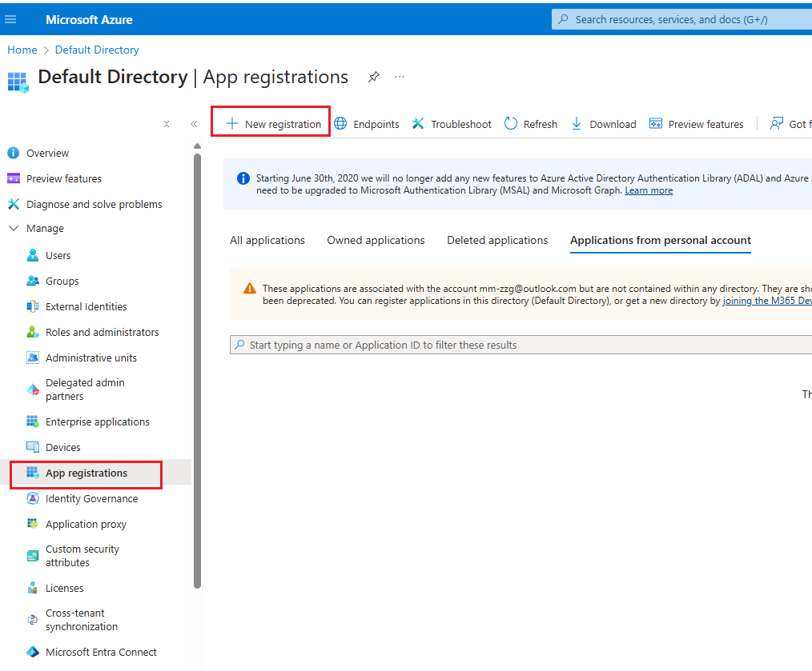
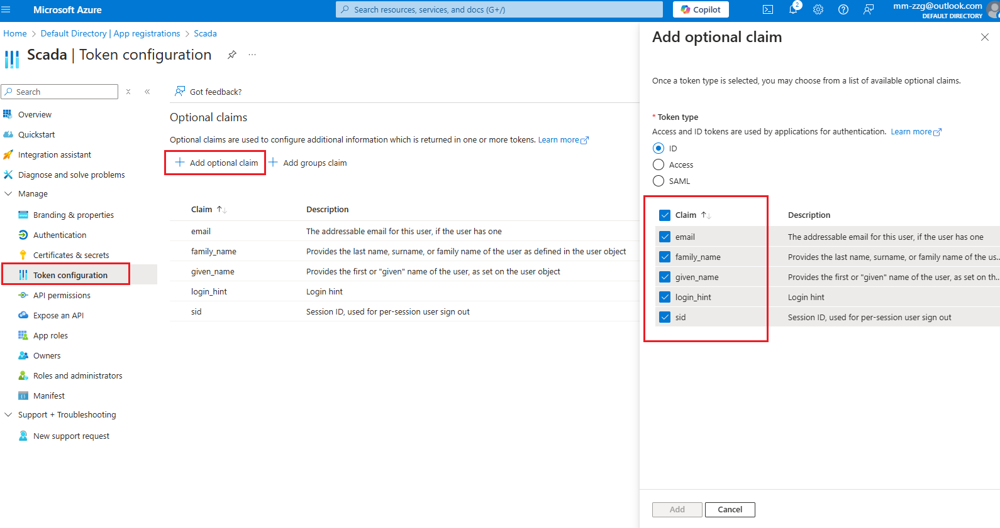
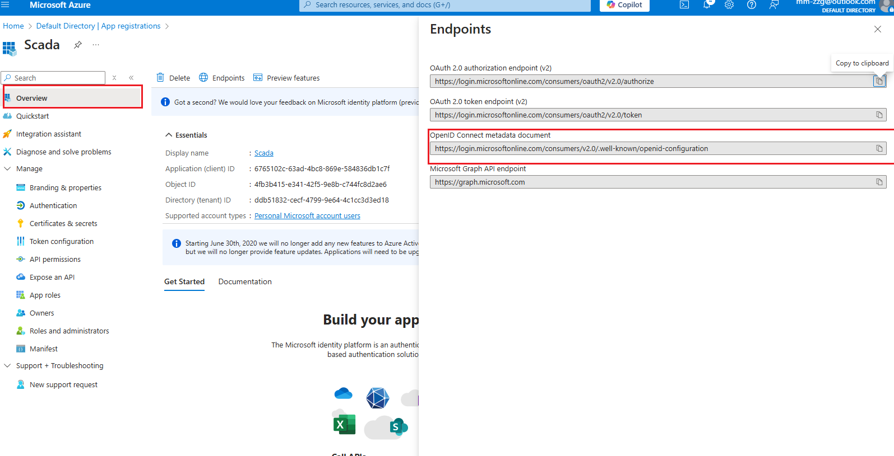
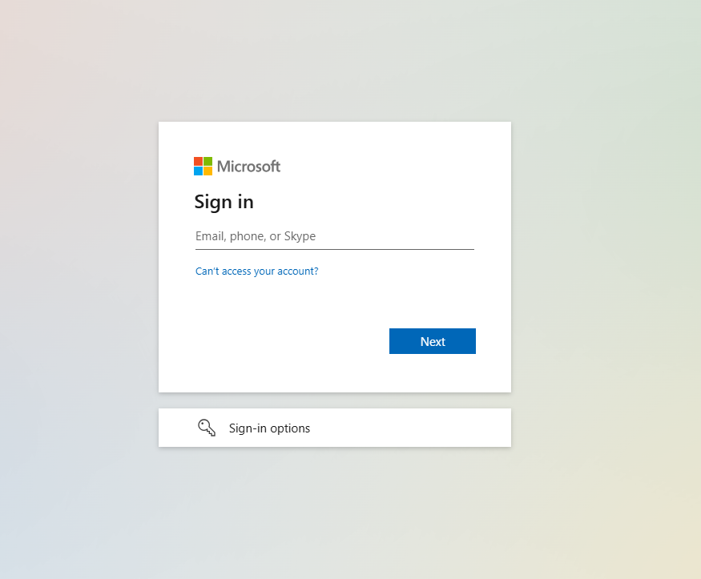
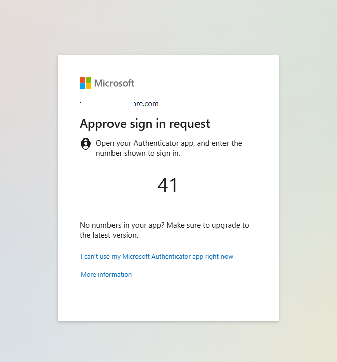

# Azure AD integration with MFA

The VC Hub  identity provider is compatible with Azure AD, enabling seamless integration. By leveraging Azure AD's multi-factor authentication (MFA) capability, the identity provider can extend MFA support to the VC Hub thereby enhancing security indirectly.

1. Open the Azure portal from Url: [ https://portal.azure.com/]( https://portal.azure.com/) , then open the Microsoft Entra ID.

    

2. Click the menu itme "App registration" in the left panel, then click the "+ New registration" icon.

    

3. Click the "Authentication" menu item in the left panel,  then fill the VC Hub login url and logout url into the "Web Redirect URIs" panel.

    

4. Click the menu item "Token configuration",  add the optional claim.

    

5. Click the menu item "Certificates & secrets", and a pair of client id and client secret.

    

6.  Copy the client id and client secret. 

    

7. Click the menu item "Overview" from the left panel, then click the "Endpoints" icon and copy the "OpenID Connect metadata document" Url

    

8. Back to the root path of "Microsoft Entra ID",  then click the "Users" menu item 

    

9. Click the "Per-user MFA" icon, 

    

10. Select the users and click the "Enable MFA" button, then MFA is enabled for the selected users. 

    

11. Navigate to VC Hub identity provider page, then create a new provider with the client id, client secret and openId onnecct meta docuemnt Url

    

12. Click the "Login Test" of the AzureAD provider, then current page is  navigated to Microsoft login page.

    

    

13. Enter the personal user account or domain account, then login page shows the random number used to verify the user account.

    

14. Enter the number into the Microsoft Authenticator on the mobile phone, then login request is auhenticated.

    

  

