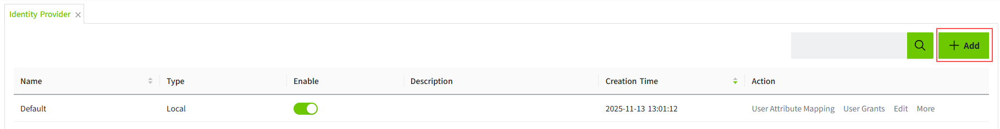
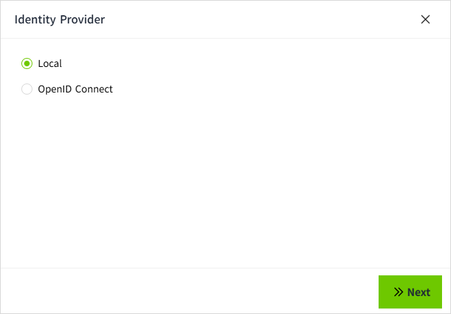
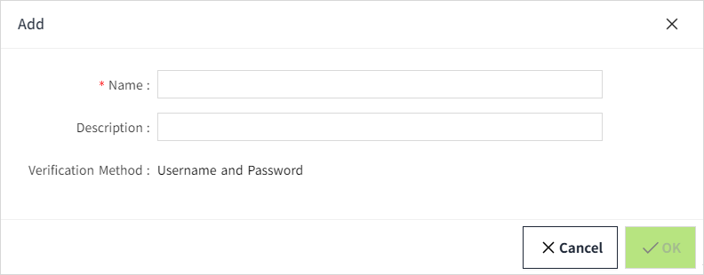
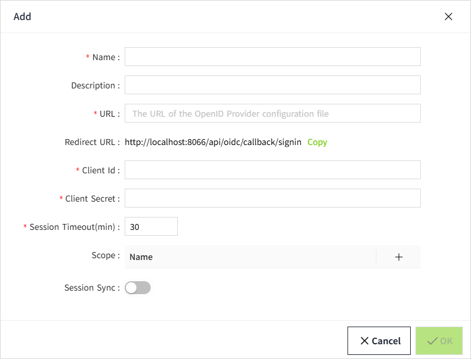

# Identity Provider

The **Identity Provider** provides a way for users to log into **VC Hub** using credentials stored outside of VC Hub. It supports **Single Sign-On (SSO)**.

VC Hub can connect to two different types of Identity Providers:

- **Local** – The built-in Identity Provider of VC Hub.
- **OpenID Connect** – An external authentication provider based on the OpenID Connect protocol.

After successfully installing VC Hub, the **Identity Provider list** will display a built-in Identity Provider by default.

 **Note:** Only **one** Identity Provider of type **Local** is allowed. 

## Add a Local Identity Provider

When the **Local** Identity Provider is enabled, users can log in using accounts created within the system.

**Prerequisite:There must be no existing **Local** Identity Provider in the system.**

1. In the **"Security" → "Identity Provider"** list, click the **"Add"** button in the upper right corner.

2. In the **Identity Provider** pop-up window, select **Local**, then click **"Next"**.

3. In the **Add** pop-up window, enter a name, then click the **"OK"** button to complete the addition.

## **Add an OpenID Connect Identity Provider**

You are allowed to create multiple **OpenID Connect** type Identity Providers.

1. In the **"Security" → "Identity Provider"** list, click the **"Add"** button in the upper right corner.
2. In the **Identity Provider** pop-up window, select **OpenID Connect** and then click **"Next"** to proceed.

3. In the **Add** pop-up window, complete the setup, then click the **"OK"** button to finish the addition.

**Properties**

| **Name**      | **Description**                                                                                                                                                                                                                                                                                                                                                                                                                        |
|---------------|----------------------------------------------------------------------------------------------------------------------------------------------------------------------------------------------------------------------------------------------------------------------------------------------------------------------------------------------------------------------------------------------------------------------------------------|
| Name          | The name of the Identity Provider.                                                                                                                                                                                                                                                                                                                                                                                                     |
| Description   | The description of the Identity Provider.                                                                                                                                                                                                                                                                                                                                                                                              |
| URL           | The URL of the OpenID Provider configuration file.                                                                                                                                                                                                                                                                                                                                                                                     |
| Redirect URL  | After OpenID Connect authentication succeeds or fails, the Identity Provider will redirect the user's browser to the VC Hub URL.                                                                                                                                                                                                                                                                                                       |
| Client Id     | The unique identifier assigned by the Identity Provider to each OpenID Connect client application.                                                                                                                                                                                                                                                                                                                                     |
| Client Secret | The confidential credentials used to authenticate the OpenID Connect client, equivalent to a "password".                                                                                                                                                                                                                                                                                                                               |
| Scope        | Through scopes, VC Hub tells the Identity Provider which user information it needs access to.  For example:   This means that VC Hub is requesting access to the user's roles and email address. |

## Important Nodes

According to the OpenID Connect (OIDC) protocol, when integrating a third-party Identity Provider (such as Auth0) into VC Hub, it is necessary to configure the login callback URL (Redirect URI) and logout callback URL (Post Logout Redirect URI) of VC Hub on the third-party platform.

When a project file is exported from the original server and imported to a new server, OIDC validation will fail if the new server’s address is not registered with the third-party Identity Provider, resulting in users being unable to log in. Therefore, after migrating the project, the new server’s callback URLs must be added to the existing configuration on the third-party platform (e.g., in the Auth0 management console).

**Example for Auth0:** In the application's **Allowed Callback URLs** and **Allowed Logout URLs** fields, append the new server's address to the existing list, separated by a comma. For example:

