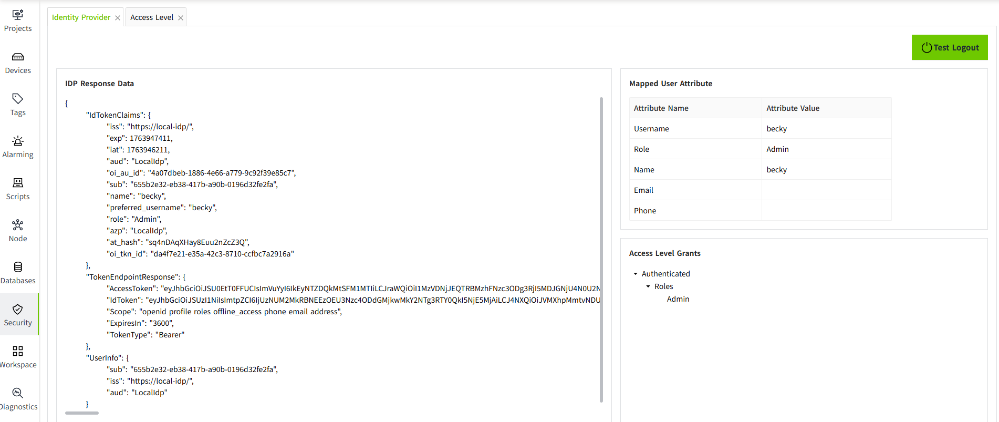

# Test Login and Logout

##  Login Test

After configuring the Identity Provider, you can use the **Login Test** to verify whether users under this Identity Provider can successfully log into the system.

##  Login Test

1. Click the ”Security“->”Identity Provider“  menu。

    

2. In the Identity Provider list, click the **"Login Test"** button in the action column for a specific entry.

    

3. A new browser window will open with the login page.。
4. Use the username and password of the currently selected Identity Provider to log in.
5. If the login is successful, you will be redirected back to the Identity Provider Login Test page, where the response result will be displayed.

    

## Test Logout 

After testing the login, you may not want to remain logged in. You can use the test logout feature to sign out.

After clicking the **"Test Logout "** button, the current page will display the Identity Provider list.

