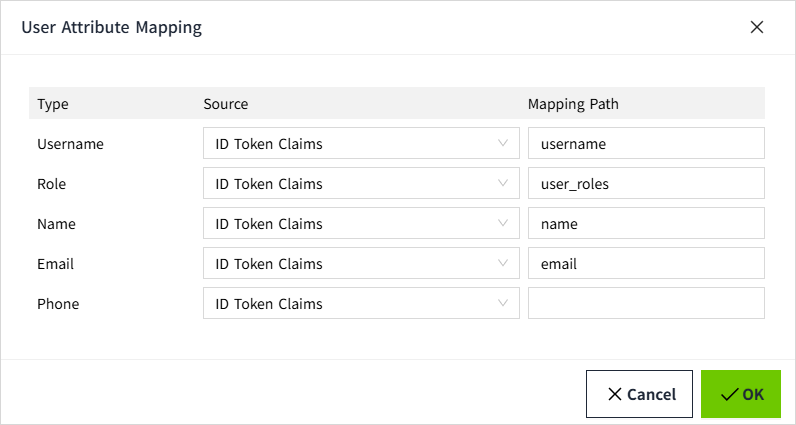

# User Attribute Mapping

User attribute mapping allows you to map information from the Identity Provider** **response document to easily understandable attributes. For this to work, VC Hub must already have a valid Identity Provider configuration that returns a response document when attempting to log in.

## Configuring User Attribute Mapping

1. Click the **"Security" → "Identity Provider"** menu.

2. In the Identity Provider list, click the "User Attribute Mapping" for a specific entry in the action column.

3. In the pop-up window, set the** **source and mapping path. The system provides the following 5 properties that can be used for mapping:

**Properties**

| **Name**     | **Description**                                                                                                                                                                                                                                                                                                                                                                                                                                                                                                                                                                                                                                                           |
|--------------|---------------------------------------------------------------------------------------------------------------------------------------------------------------------------------------------------------------------------------------------------------------------------------------------------------------------------------------------------------------------------------------------------------------------------------------------------------------------------------------------------------------------------------------------------------------------------------------------------------------------------------------------------------------------------|
| Username     | Mapping for username.                                                                                                                                                                                                                                                                                                                                                                                                                                                                                                                                                                                                                                                     |
| Role         | Mapping for role.                                                                                                                                                                                                                                                                                                                                                                                                                                                                                                                                                                                                                                                         |
| Name         | Mapping for name.                                                                                                                                                                                                                                                                                                                                                                                                                                                                                                                                                                                                                                                         |
| Email        | Mapping for email.                                                                                                                                                                                                                                                                                                                                                                                                                                                                                                                                                                                                                                                        |
| Phone        | Mapping for phone.                                                                                                                                                                                                                                                                                                                                                                                                                                                                                                                                                                                                                                                        |
| Source       | The mapping includes the following:   - **ID Token Claims**: These are the claims in the ID token used to represent the user's identity information. They typically include attributes like, `name`, `email`, etc.  - **Token Endpoint Response**: This is the response from the token endpoint, which typically includes the Access Token, ID Token, and Refresh Token. These tokens are used to authenticate and authorize the user.  - **User Info Claims**: These claims contain detailed user attributes such as name, email, profile picture, and other personal information. These are usually returned by the Identity Provider when querying the UserInfo Endpoint. |
| Mapping Path | It is typically used to map the user information returned by the **Identity Provider** to the local system's user model, ensuring that the application can correctly identify and authorize the user.                                                                                                                                                                                                                                                                                                                                                                                                                                                                     |

4. Click the **"OK"** button to complete the setup.

**Example**

1. Assume the **ID Token** returned by the **Identity Provider** contains the following information:

{

  "username": "alex",

  "email": "alex@example.com",

  "user_roles": "admin"

  "name": "Alex Zhang"

}

2. The mapping paths can be set as follows:：

- `username` → **The** **local username（username）**
- `email` → **The** **local email（email）**
- `user_roles` → **The** **local role（role）**
- `name` → **The** **local name（name）**

3. In **VC Hub**, the end-user information is mapped as follows:

{

  "username": "alex",

  "email": "alex@example.com",

  "role": "admin"

  "name": "Alex Zhang"

}