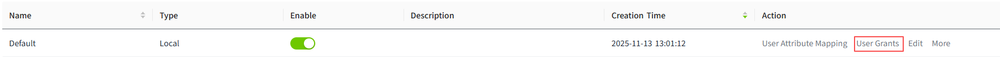
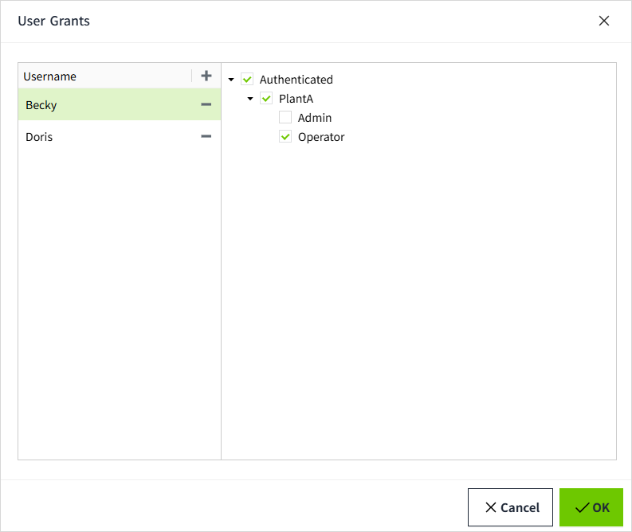

# User Grants

User Grants is a method of directly assigning users to access levels. It essentially overrides the original rules of security levels.

You can authorize users through the **Security-> Identity Provider** list by clicking the **User Grants** button. Users can be added, allowing you to later assign them specific access levels.

**Note:** Adding or removing users in User Grants does not affect the users within the **Identity Provider**.

You can assign any number of access levels to these users by their **username**. Selecting a level will automatically select all levels above it.

User Grants can only be applied to users after they authenticate through the Identity Provider.

**Note:** The system cannot verify any users created here based on the actual users in the Identity Provider. Instead, the **username** needs to be entered **accurately**, including case sensitivity. When users log in, the system will check if their username matches any of the configured usernames to grant user authorization.

## Configuring User Grants

Configuring user grants is divided into two parts: adding users, assigning access levels to users.

1. Click the **"Security" → "Identity Provider"** menu.

    

2. In the **Identity Provider** list, click the **"User Grants"** in the action column for a specific entry.

    

3. In the pop-up window, click the **"Add"** button to add a username.

    

4. Select a user, and set the access levels for that user on the right-side panel. The currently selected user will be highlighted.

    

5. After setting the access levels for one user, continue selecting the next user to configure their access levels. Once all users have been configured, click the **"OK"** button to save the settings.

