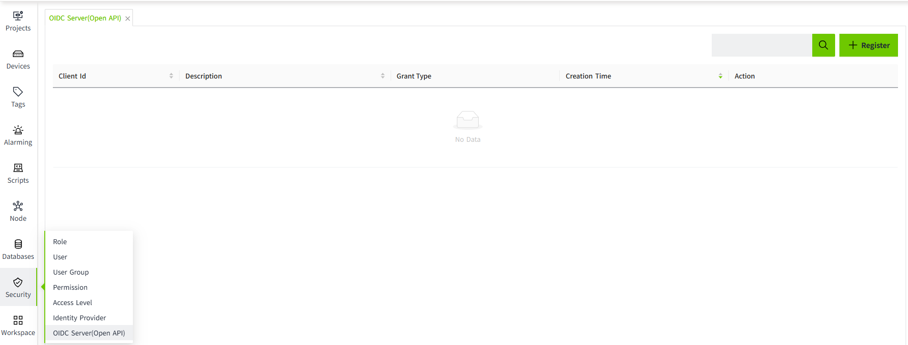
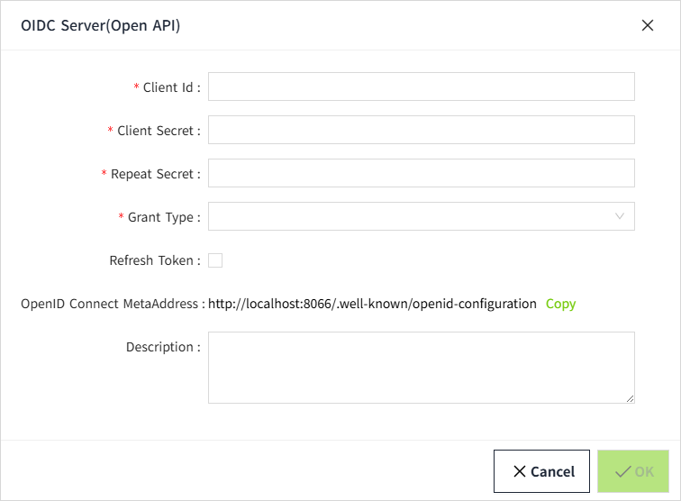
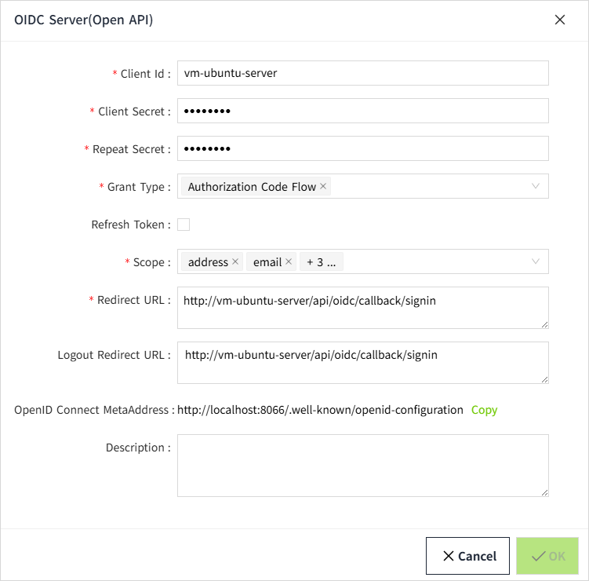

# OIDC Server(Open API) Registrations

 VC Hub includes a built-in OpenID Connect (OIDC) identity server, which is used to authenticate users using industry-standard OIDC protocols. 

The OIDC server supports different flows in in OIDC protocols for different kinds of applications.

- **Authorization Code Flow**: Suitable for Web applications (server-side applications).
- **Implicit Flow**: Suitable for Single-page applications (SPAs) and mobile applications.
- **Client Credentials Flow**: Suitable for Machine-to-machine (M2M) communication without end-user involvement.
- **Refresh Token Flow**: This flow is used to refresh the access token for third party application, and this flow can be used with the other flows except Client Credential Flow.

Click on "**Security**"-> "**OIDC Server(Open API)**" to configure the OpenID Connect(OIDC) client registerations. 

## Register

Click the "Register" button to add new  OpenId Client.

**Properties**

| **Name**                   | **Description**                                                                                                                                                                                                                                                                                           |
|----------------------------|-----------------------------------------------------------------------------------------------------------------------------------------------------------------------------------------------------------------------------------------------------------------------------------------------------------|
| Client Id                  | The id of client credential                                                                                                                                                                                                                                                                               |
| Client Secret              | The secret of client credential                                                                                                                                                                                                                                                                           |
| Repeat Secret              | The repeat secret of client credential used to ensure user enter two same secret                                                                                                                                                                                                                          |
| Grant Type                 | OIDC authorization modes include Authorization Code Flow, Client Credentials Flow, Implicit Flow, and Refresh Token Flow. Supports multiple selections. When the Client Credentials mode is selected, the required APIs must be configured. For the other three modes, configuring APIs is not necessary. |
|Refresh Token                 | Optional, default not selected.Use in combination with the Grant Type.|
| Scope                      | The scopes of user info. The scope includes: address,email,phone,profile,roles                                                                                                                                                                                                                            |
| Redirect URL               | The redirect URL. When login on VC Hub OIDC login page, the user will be redirected the Redirect URL.                                                                                                                                                                                                      |
| Logout Redirect URL        | When user logout from VC Hub OIDC endpoint, the user will be redirected the Logout Redirect URL.                                                                                                                                                                                                           |
| OpenID Connect MetaAddress | A URL for auto-discovery of Identity Provider (IdP) configurations.                                                                                                                                                                                                                                       |
| Description                | The description the client credential                                                                                                                                                                                                                                                                     |

 **Note**：**When registerating a new open client,  the content should be based on purpose of the client application.** 

#### Scenario 1:  A client application configurated to use VC Hub as its identity provider to authenticate its end user.

1. When registering an OpenID client, select the **Authorization Code Flow** or **Implicit Flow**. It is recommended to use **Authorization Code Flow** for better security.
2. Enter the redirect url and logout redirect url of the client application. 

     Take VC Hub as an example:

     The **Redirect URL:** http://{client-applicatoin-host}/api/oidc/callback/signin 

     The **Logout Redirect URL:** http://{server-host}/.well-known/openid-configuration

     

3. Open the **Identity Provider** configuration interface in the client application.Enter the following information:Client ID,Client Secret.

If VC Hub is the client application, you should fill in the identity provider configuration page with the client information you previously registered.

#### Scenario 2:  The client application interacts with VC Hub by making Open API requests from its backend

1. When registering an **OpenID client**, you should select only the **Client Credentials Flow** as grant type.

     In this mode, the **client application** can request an **access token** directly by using its:

      - **Client ID**
      - **Client Secret**

     

2. After the client application is registered, click the "**Open API**" button to configure the which APIs third party application can use the credential to call.

     

     

## Edit

After new credential created, click the "**Edit**" button to edit change the credential description.

## Reset Secret

Click the "**Reset Secret**" button to reset the secret of the credential.

## Delete

Clicking the "Delete" button will remove the API authorization. Once deleted, this authorization can no longer be used to access the interface data of VC Hub.

## Security Recommendation

Given the differing use cases and security considerations of these flows, we stongly recommend registering clients that only support only one authorization flow, based on your specific application needs. Avoding registerting a client that supports mutiple flows simultaneously.

**Reason:** Supporting both flows in the same client might lead to security risks or configuration conflict. For example, tokens issued using client credential could bypass user authentication, potentially inroducing authorization vulnerabilities. 

**Best Practices:**

- If your application is intended for end-user  interactions, select the **Authorzation Code Flow**.
- If your application is designed for server-to-sever comunication (e.g.,Open API), select the **Client Credential Flow**.The Open API of VC Hub is designed for server-to-server, as the its permissions of APIs are tied to the client ID.

By selecting the appropriate authorization flow, you can enhance the security of your client while ensuring your application operates in compliance with beset practices.

