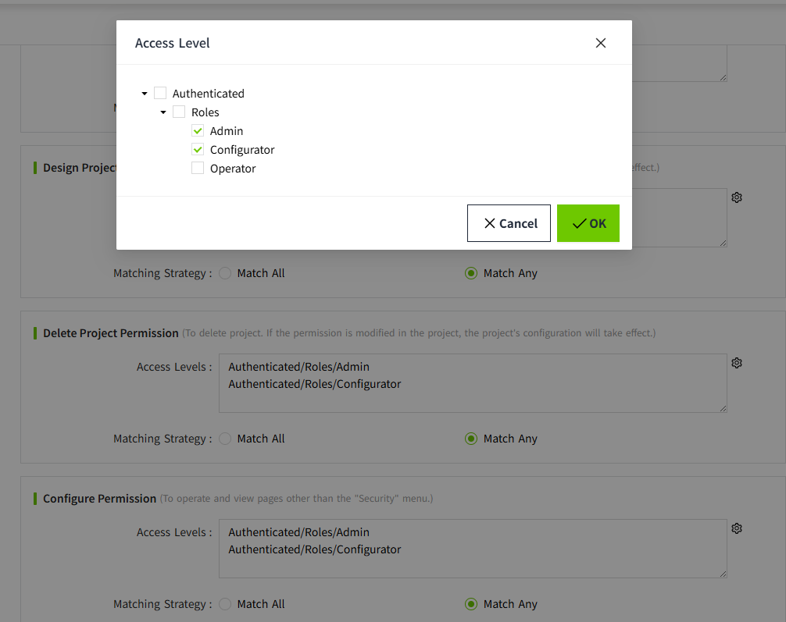

# Permission

It is used to carry out permission control for the operations of the management platform and the addition of new projects. 

Click "Security" -> "Permission" in the menu bar, and you can enter the permission configuration page. Users can flexibly configure permissions according to their needs.

It includes six categories:

1. **Create Project Permission**
2. **Design Project Permission**
3. **Delete Project Permission**
4. **Configure Permission**
5. **View Permission**
6. **Security Permission**

| **Category**              | **Description**                                                                                                                                                                                                                                                                                                                                                                                                                                         | **Default permissions**                                     |
|---------------------------|---------------------------------------------------------------------------------------------------------------------------------------------------------------------------------------------------------------------------------------------------------------------------------------------------------------------------------------------------------------------------------------------------------------------------------------------------------|-------------------------------------------------------------|
| Create Project Permission | It is used for **adding** new projects, **copying** projects and **importing** projects.  | Authenticated/Roles/Admin  Authenticated/Roles/Configurator |
| Design Project Permission | After creating a project, it is used as the initial permissions for designing the project. If the permissions are later modified within the project, the updated project-specific settings will take precedence.  | Authenticated/Roles/Admin  Authenticated/Roles/Configurator |
| Delete Project Permission | After creating a project, it is used as the initial permissions for deleting the project.  If the permissions are later modified within the project, the updated project-specific settings will take precedence. | Authenticated/Roles/Admin  Authenticated/Roles/Configurator |
| Configure Permission      | It is used for permission control of the admin console. It allows users to **view** and **operate** on pages other than the "Permission" menu.                                                                                                                                                                                                                                                                                                    | Authenticated/Roles/Admin  Authenticated/Roles/Configurator |
| View Permission           | It is used for the permission control of the admin console. It is used to **view** other pages except the "Permission" menu.                                                                                                                                                                                                                                                                                                                      | Authenticated/Roles/Operator                                |
| Security Permission       | It is used for the permission control of the admin console and for **viewing and operating** the pages related to the "Permission" menu.                                                                                                                                                                                                                                                                                                          | Authenticated/Roles/Admin                                   |

 **Notes:**  
 
 1. **Admin, Configurator, and Operator** among the above default permissions are **system-built-in roles**.
 2. The following page is referred to as the admin console.

 

#### **Configure Permission**

1. **Configure the Access Level**

    **Method 1**: Manually enter the path in the Access Level textarea.

    

    In order to avoid manual input errors, you can go to the Access Level page, copy the path, and then paste it on the Permission page.

    

    **Method 2:** Click the settings button on the right side of the Access Level textarea.

    

    In the Access Level pop-up window, select the required permissions.

    

    **Note: Each node in the Access Level can be selected independently.**

    For example, as shown in the following figure.

    

    After clicking the “OK” button, the following path will be displayed in the Access Level textarea of the corresponding category on the Permission page:

    

    **Note:** If all the content in the Access Level textarea is deleted, "**Authenticated**" will be automatically filled in. This means that any user who successfully logs in will have this permission.

2. **Set the matching strategy**

    The matching strategy is set to "Match Any" by default. Users can adjust it according to the actual situation, and only one matching strategy is supported for selection.

| **Matching Strategy** | **Description**                                                                                    |
|-----------------------|----------------------------------------------------------------------------------------------------|
| Match All             | Users must have all access levels in order to possess the corresponding permissions.               |
| Match Any             | Users can have the corresponding permissions as long as they possess any one of the access levels. |

3.**Click the "OK" button to save.**