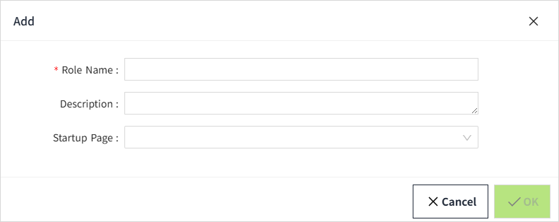

# Roles and Users

VC Hub provides 3 built-in roles.

- Admin: Has all privileges.  
- Configurator: The only difference from Admin is that Admin cannot be selected for the role when creating a user.  
- Operator: Can only view the running page of the project and view the devices.

## **Creating Roles**

You can add other roles in the Roles page.

1. Click ”Security” > ”Role” in the menu.
2. Click the Add button on the Role list page to create a role.

**Configurations:**

| **Name**     | **Description**                                                                                                                                                           |
|--------------|---------------------------------------------------------------------------------------------------------------------------------------------------------------------------|
| Role Name    | The name of this role.                                                                                                                                                    |
| Description    | The description of this role.                                                                                                                                                    |
| Startup Page | You can configure a startup page for a role when the role can only view the running page of a specific project. Select a page from all project pages as the startup page. |

## **Creating Users**

When you log in for the first time, the first user created during installation is displayed in the user list. You can add other users on the users list page.

1. Click "Security"> "User".
2. Click the Add button on the user list page to create a user.  Only one role can be set for a user. 

