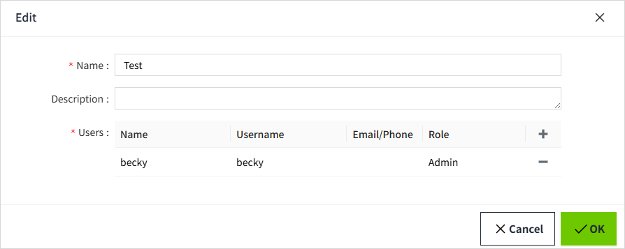
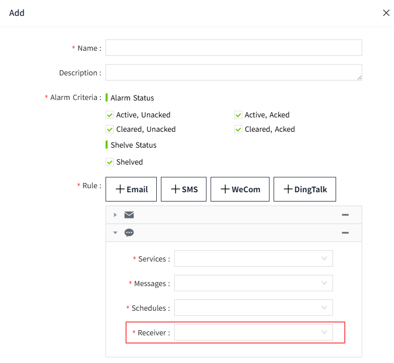

# User Group

Used to group users who receive alarm notifications. Each group contains specific users. When an alarm occurs, notifications are sent to the corresponding users according to the rules .

## Create and Manage User Group

#### Add

1. On the "Security" -> "User Group" page, click the "Add" button to create a new user group.

2. In the pop-up window, set the name of the user group and click the "Add" button to add users to the group.

| **Configuration** | **Description**                                                             |
|-------------------|-----------------------------------------------------------------------------|
| Name              | The name of the user group, which must be unique and is a required field.   |
| Description       | Optional field for describing the user group.                               |
| Users             | Assign users to this user group. A user can belong to multiple user groups. |

3. Once all settings are completed, click the "OK" button to complete the creation.

#### Search

User groups are sorted by default in descending order of creation time, but users can customize the sorting as needed. Users can also perform a fuzzy search by user group name using the input field in the upper-right corner.

#### Edit

Click the "Edit" button on any user group in the list to modify the group's information. In the user group edit dialog, all users associated with the group will be displayed.

**Note:** If the user group name is changed, any alarm notification rules that use this group will lose their association with the group. Please be cautious when modifying the user group name.

#### Delete

Click the "Delete" button to remove a user group. 

**Note:** When a user group is deleted, any alarm notification rules that use this group will lose their user group information. Please be cautious when deleting a user group.

## How to Use User Group

In the "Alarming" -> "Alarm Notifications" section, select a user group as the recipient for alarm notifications under "**Rules**." For more details, refer to the **Alarming->Alarm Notifications->Rules**.

