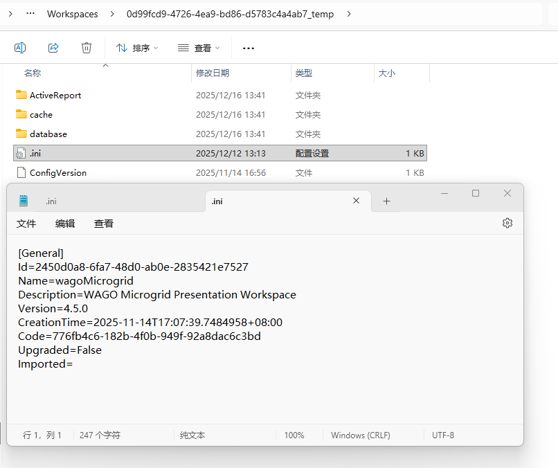

# Cannot Log In

**Note** **:** If you forget all administrator user passwords for the current workspace you will not have any opportunity to log back into the current workspace. Please make sure to securely store the password.

If you are unable to log into the current workspace, you can try switching workspaces or creating a new workspace.

# Method 1: Switching Workspaces

If you have other workspaces in your system and have the login information for those workspaces, you can manually switch to one of them.

1. **Log in to the VC Hub installation server.**
2. **Go to the user data directory.**
      - For Windows installation, the default user data directory is: “%ProgramData%\WAGOVisualizationAndControlHub”, usually located at “C:\ProgramData\WAGOVisualizationAndControlHub”.
      - For Linux installation, the default user data directory is: `/usr/share/`wagovisualizationandcontrolhub.
      - If you changed the user data directory during installation, go to the directory you modified.
3. **Navigate to the \Workspaces folder.**

      This directory contains all the workspaces, with each workspace stored in its own separate folder.
      Go to the root directory of a specific workspace folder, where you can check the **“.ini”** file to view information such as the workspace name.
      
4. **Modify the ".ini" file in the root directory of the workspace folder.**
       Change the **Current** field to the **target workspace ID**.
5. **Restart the service**
6. **Log in using the switched workspace user information**

# **Method 2: Create a New Workspace**

If there are no other available workspaces in your system, Method 1 will not be applicable. In this case, you can choose to create a new workspace.

1. **Log in to the VC Hub installation server.**
2. **Navigate to the program installation directory.**
      - Default installation directory for Windows: `C:\Program Files\WAGO Visualization And Control Hub`
      - Default installation directory for Linux: `/usr/local/bin/wagovisualizationandcontrolhub-x.x.x-linux-x64`
      - If you changed the installation directory during setup, go to your custom installation directory.
3. **Delete the "workspace_initialized" file in the root directory**
4. **Restart the service**
5. **Refresh the frontend page, and you will be guided to create a new workspace Simply enter a username and password to complete the workspace creation.**
