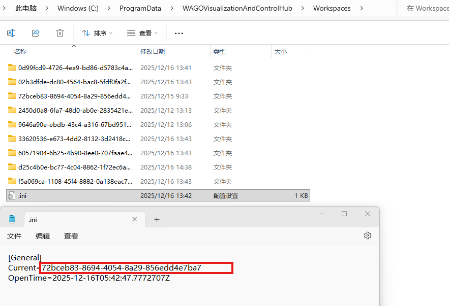

# 无法登录工程

 注意：如果您忘记了当前工程的所有管理员用户密码，您将没有机会再登录进入当前工程，请妥善保存工程密码。

无法登录当前工程可以尝试切换工程或创建新工程。

## 方法1：切换工程

当你忘记当前工程的密码，但是依然记得其他工程的密码，可以手动切换到该工程。

1. **登录WAGO VC Hub安装服务器**
2. **进入用户数据目录**

   - Windows 安装环境默认用户数据目录：“%ProgramData%\WAGOVisualizationAndControlHub”，一般在 “C:\ProgramData\WAGOVisualizationAndControlHub”。
   - Linux 安装环境默认用户数据目录：/usr/share/WAGOVisualizationAndControlHub
   - 如果您安装时修改过用户数据目录，请进入您修改的用户数据目录。
3. **进入工程文件夹\Workspaces**

该目录下包含了所有工程，每个工程存储在独立的文件夹中

进入某个工程文件夹根目录查看“.ini”文件可以查看该工程名称等信息   

4. **修改工程文件夹根目录的".ini"文件**

      将Current字段修改为目标工程id

5. **重启服务**
6. **用切换后的工程用户信息进行登录**

## 方法2：创建新工程

当你忘记所有工程的密码时，方法1将不适用，此时您可以选择创建新建工程。

1. **登录WAGO VC Hub安装服务器**
2. **进入程序安装目录**

 默认服务安装目录：

**Windows**：`"C:\Program Files\WAGO SCADA" `

**Linux**：`"/usr/local/bin/wagoscada"`

 如果您安装时修改过安装目录，请进入您修改的安装目录。

3. **删除根目录" workspace_initialized"文件 **
4. **重启服务**
5. **刷新前端页面将会重新引导创建新工程，输入用户名密码即可完成创建新工程**

