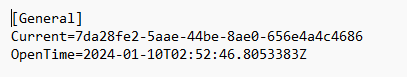

# Current Workspace Configure File

 The current workspace configuration file is a .ini suffixed configuration file containing configuration information that is used as a basis for the VC Hub  service when it is started.

 The standard contents of this file are shown in the figure below, where **Current ** represents the ID of the current workspace, pointing to the name of a workspace folder, and **OpenTime**  represents the time of the latest workspace switch.

