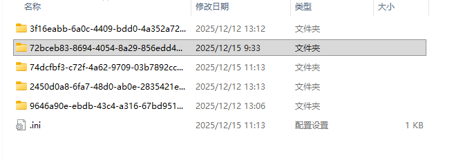

# 工程

**WAGO VC Hub**系统主要可被分为三个部分：**证书**、**工程**、**网络**。证书主要用来激活系统，保证VC Hub系统整体使用权限，而网络主要用来管理系统的基础网络信息、冗余、组网以及复杂网络架构的配置。

除证书和网络相关模块之外，其它所有模块都可以被认为是工程的子集，而WAGO VC Hub可以，因此，单个工程可以被认为是一个独立的配置容器，包含在其中配置项包含：

- [项目](../projects/index.md) ：项目主要对组态画面的管理，一个项目可以拥有多个画面，包含2D组态和3D组态两种组态方式，用户可以根据需求，在项目模块中绘画出目标工业场景。
- [设备](../devices/index.md) ：WAGO VC Hub系统可对接多种工业协议，设备模块主要用来管理工业协议连接信息，以保证系统与实际工业生产设备的交互。
- [资产和变量](../assets-and-tags/index.md) ：用于系统展示、处理工业数据的媒介，变量可绑定设备模块中的协议信息并作具体配置，在成功配置后，变量将通过对应的协议接收实际设备数据以及对设备下发指令。
- [报警](../alarming/index.md) ：主要要与配置报警历史存储相关信息以及陈旧报警处理。
- [脚本](../scripts/index.md) ：在相对复杂的数据处理场景中，用户可以通过脚本模块编辑Javascript代码，对部分系统数据进行读取和写值。
- [数据库](../databases/index.md) ：用于配置系统与外部数据库的连接信息，通过这些连接变量、报警的历史数据可以被记录到WAGO VC Hub所支持的数据库中，如InfluxDB、MySQL等。
- [权限](../security/index.md) ：用于配置单个工程的角色、用户信息，主要用来对系统功能权限的使用管理。权限的配置仅在当前工程中生效，在多工程场景下，每个工程都会拥有独立的权限体系。

#### 初始工程

WAGO VC Hub系统的启动会基于一个工程启动，这是系统运行的一个重要依据，在服务器系统中存在一个完整的工程文件夹，是系统正常运行操作的一个先决条件。

因此，在初次运行WAGO VC Hub系统时，系统将会检测当前服务器系统中是否存在任意工程文件，如果不能存在，那么系统将会在服务器系统的数据目录中初始化一个名为*Default*的工程，作为系统工作目录。在后续的系统操作中，上述提到各个模块的数据，将被存储这个初始化工程的文件夹中。

#### 工程数据存储

###### 存储目录

所有的工程数据，将会以文件形式存储到服务器系统中数据目录位置，目前WAGO VC Hub系统部署服务器仅支持**Windows**和**Linux**两种，二者工程目录的存储位置有所不同：

- **Windows**：通常指向 *C:\ProgramData\*WAGOVisualizationAndControlHub*\Workspaces\* ，是Windows系统用于存储应用程序数据的特定系统目录。
- **Linux**：固定指向 */usr/share/*WAGOVisualizationAndControlHub*\Workspaces*

###### 目录结构

一个完整的工程数据根目录中，应至少包含一个 *.ini *文件和一个随机**GUID**命名的工程文件夹。下图为**Windows**系统中工程数据目录。

- [known-link] ：当前工程配置文件是一个*.ini*为后缀的配置文件，其中的配置信息，作为WAGO VC Hub服务启动时的依据。
- [known-link] ：单个工程目录中存储了一个工程所有的工程数据，包含工程基础信息，以一个随机的GUID字符串命名，同时也作为一个工程的唯一标识。一个WAGO VC Hub节点中可以包含多个工程，工程与工程间的工程名必不相同。

