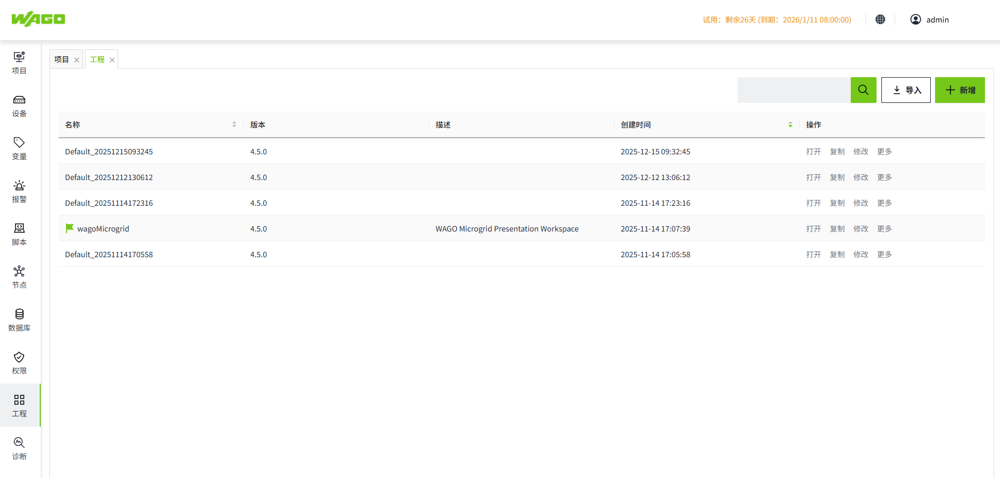
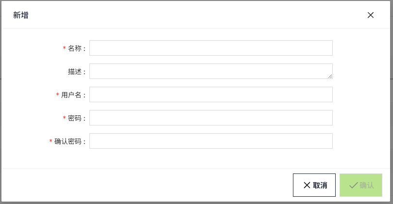
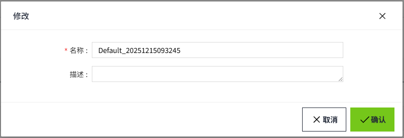
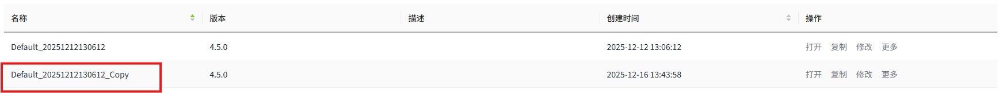
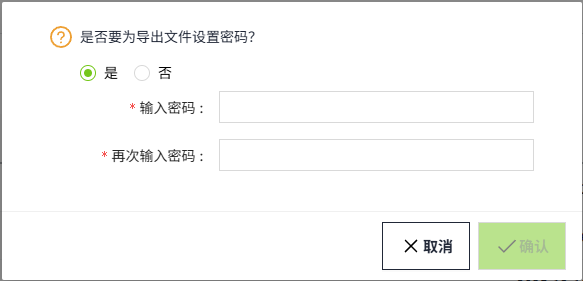
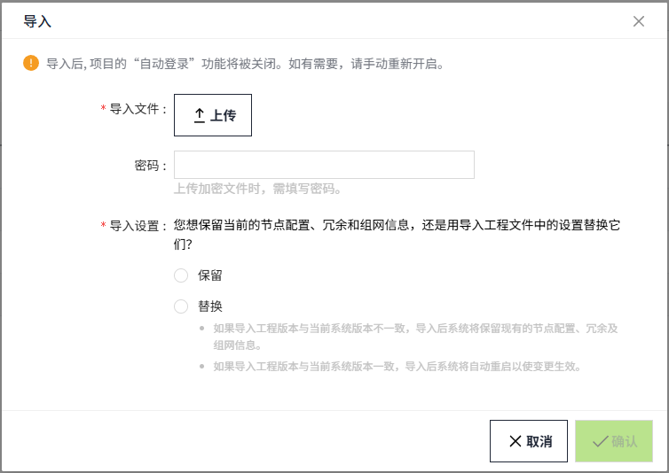
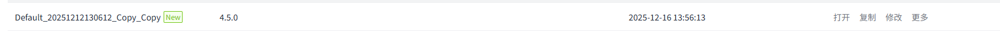

# Multi-workspace management

## **Workspace Management Menu**

After successfully log in, users can enter the workspace management list by clicking the workspace menu on the left menu bar.

## **Function Description**

#### **Search**

After entering the workspace management page, the user can view all the workspaces in the current VC Hub system, which are listed in reverse chronological order by default, and can be customized according to the user's needs. Currently, it only supports the reverse chronological order of the **creation time** and name.

In the list, the workspace currently in use will display a "flag" in front of the workspace name.

Users can do fuzzy query on workspace name through the input box in the upper right corner.

#### **Add**

Users can add new workspaces by clicking the "**Add**" button at the upper right corner and filling in the workspace information.

**Configuration items**

| **Configuration**      | **Description**                                                                          |
|------------------------|------------------------------------------------------------------------------------------|
| Name                   | The name of the workspace.                                                               |
| Description            | The description of the workspace.                                                        |
| Username               | The username used to initialize the system when switching workspaces for the first time. |
| Password               | The password used to initialize the system when switching workspaces for the first time. |
| Confirmation PPassword | The second confirmation password must be the same as the password configuration.         |

#### **Edit**

Users can click the **Edit** button on the right side of any workspace in the workspace list to edit the name and description of the workspace.

#### **Open**

Users can switch to the target workspace by clicking the **Open** button on the right side of any workspace in the workspace list. After clicking the button, a confirmation prompt box will pop up, and the page will enter the **Loading** state after the user clicks the OK button, and the background process of VC Hub will be restarted automatically, and after completing the restarting process, the page will be automatically jumped to the **login** page.

Note that after the switch, all users who are using the current system will be switched to the workspace; during the restart process, the system will be temporarily disabled, and refreshing the page will cause the browser to fail to connect to the server, so wait for a few moments, and then re-enter the website can still be accessed normally.

#### **Copy**

Users can click the "**Copy**" button on the right side of any workspace in the workspace list, after clicking Copy, an edit box will pop up, the default name of the copied workspace is "{original workspace name}_Copy", users can modify the name and description according to their needs, then click "**OK**" button. The default name of the copied workspace is "{original_workspace_name}_Copy".

After successful copying, a brand-new workspace will be generated, the internal data is exactly the same as the copied Default workspace: 

#### **Delete**

Users can move their mouse over any of the workspace "**More**" buttons to display more drop-down menu options. 

After clicking the "**Delete**" button, a deletion prompt box will pop up, click on the **OK**, the selected workspace data will be deleted.

Note: Deletion is not recoverable after deletion, please be careful; the delete button of the current workspace will be disabled.

#### **Export**

The "More" dropdown menu under any project data includes an **Export** option, allowing users to export and download workspace data as needed.
During the export process, users can optionally **set a password** for the exported file to enhance data security.

The exported file is saved in `.wsbk`** **format to the local Downloads directory. It can be used for workspace backup and synchronization across multiple nodes.

#### **Import**

The user can click the **Import** button in the upper-right corner to import a previously exported* .wsbk* file into the VC Hub system.

Select a local *.wsbk* file. If a password was set during export, you must enter the correct password to proceed with the import. Workspaces without a password can be imported directly.

Users can choose whether to retain the current system’s **node settings, redundancy **and **networking **information during import.

- If **Keep** is selected, the current node settings, redundancy and networking settings will remain unchanged after the import.
- If **Replace** is selected, the workspace data will be successfully imported. The node settings, redundancy, and networking information from the import file will overwrite the corresponding configuration of the current node. After the import is completed, the system will automatically restart, and the login page will be displayed after the restart.

If the name of the imported workspace is the same as an existing workspace in the list, the system will automatically append **_Copy** to the imported workspace’s name.

For a newly imported workspace, a **“** **New** **”** icon will be displayed after the workspace name for 30 minutes following the import.

