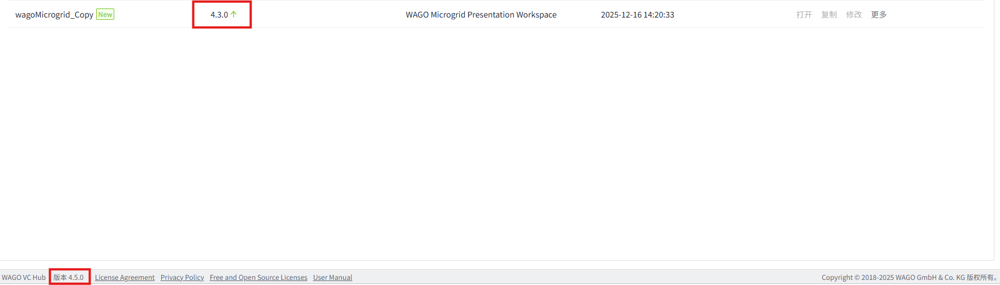
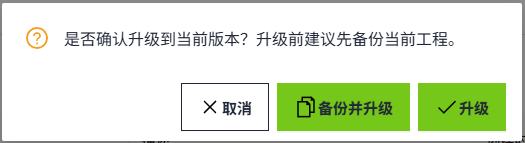
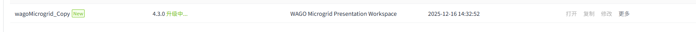
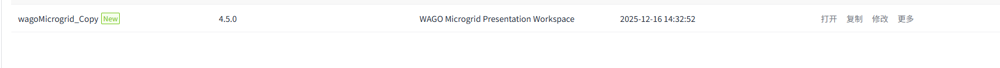
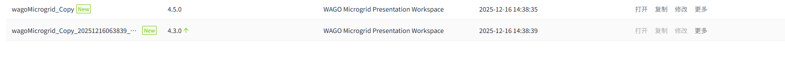
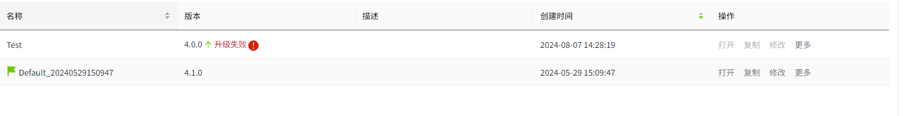
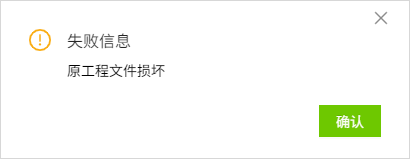

# Upgrade Workspace

## Overview

When workspaces in the system are on versions lower than the current system version, users won’t be able to open, copy, or edit them. To address this, an upgrade is necessary to ensure compatibility and access. Users can initiate the upgrade by clicking the green upgrade arrow button next to the corresponding version number. The process is handled server-side, where the workspace is seamlessly updated to match the current system version. This upgrade retains all existing data from the older version, ensuring that no information is lost while enabling full functionality in the latest system environment.

## How to Operate

As shown in the figure below, there are two workspaces in the list. The workspace named "Default" has a version of 4.3.0, which is lower than the system version displayed in the lower right corner (4.4.0). Since it meets the upgrade criteria, a green upgrade arrow button is displayed next to the version number.

After the user clicks the upgrade button, the system will prompt a dialog asking whether to Backup. The user can choose to either "Upgrade" or "Backup and Upgrade" based on their needs.

After clicking the "Upgrade" or "Backup and Upgrade" button, the upgrade arrow will change to "Upgrading..." indicating that the system is currently upgrading the workspace in the background.

If the user selects "Upgrade" , then after a successful upgrade, only the updated workspace named "Test" with the new version 4.4.0 will appear in the list, while the old version 4.3.0 of the "Test" workspace will be removed.

If the user selects "Backup and Upgrade," then after a successful upgrade, the list will contain both the updated workspace named "Test" with the new version 4.4.0 and an additional backup of the old version 4.3.0, named "Test_{Backup Time}_bak," as shown in the figure below.

If any error occurs during the backend upgrade of the workspace, the upgrade will fail. A red "Upgrade Failed" message will appear next to the upgrade arrow to alert the user. The user can click on the adjacent exclamation mark button to view detailed information about the failure.

Users can attempt to resolve the issues based on the failure information. After resolving the issues, the user can click the upgrade arrow button again to retry the upgrade process.
