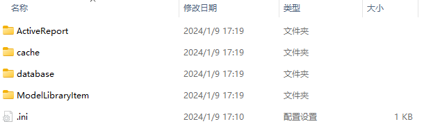
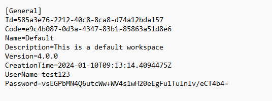

# Workspace Directory

 A single workspace directory stores all workspace data for a workspace and contains the workspace base information, with a random GUID string as a unique identifier for the workspace.

 A VC Hub node can contain more than one workspace, and the workspace name needs to be unique.

## **Content Analysis**

 Each workspace directory contains two parts, the workspace basic information file and the workspace data file. The workspace basic information file has the same naming and file format as the **Current Workspace Configure File** , and the workspace data file is used to store business data and files within the current workspace and is used to store part of the system's business data, and the structure of the directory is as follows:

#### **Workspace basic information file**

 The workspace basic information file is a configuration file with. ini as the suffix, and the standard content is shown in the following figure:

- **Id** : workspace catalog identification, the same as the workspace catalog name.
- **Code** : workspace number, two identical workspaces, workspace number is the same, such as a workspace is exported, and then imported, the workspace number remains unchanged, but Id will change.
- **Name** : name of the workspace.
- **Description** : description of the workspace.
- **Version** : Version number of the workspace, used to record the VC Hub version of the workspace.
- **CreationTime** : The time when the workspace was created.
- **UserName** : The user name used for initializing the workspace, which is used as the initial username for logging in after switching to the workspace for the first time. After switching to the workspace for the first time and completing the workspace initialization, the user name will be blank.
- **Password** : The password used for workspace initialization, encrypted and temporarily stored in the workspace base information file when the user successfully creates the workspace, and used together with the User Name for login after switching to the workspace for the first time. After switching to the workspace for the first time and completing the workspace initialization, the password will be blank.

#### **Workspace Data File**

 It is used to store the internal business data and files of the workspace, which mainly contains the business data of seven modules: workspace, device, asset and tag, alarm, script, data and permission.

