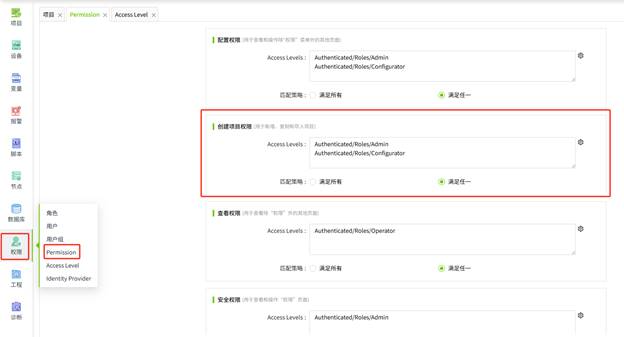
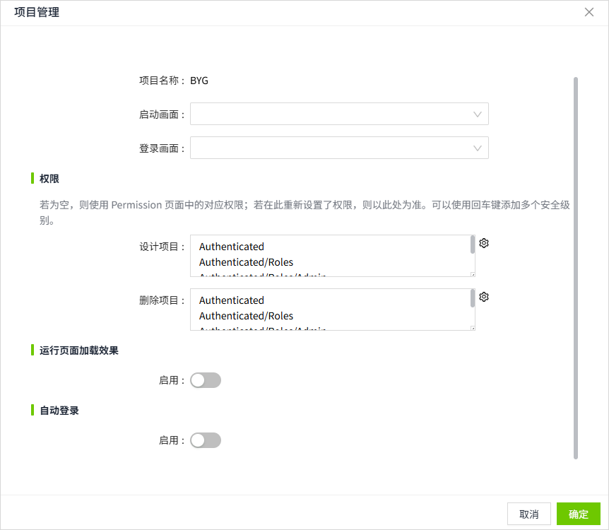
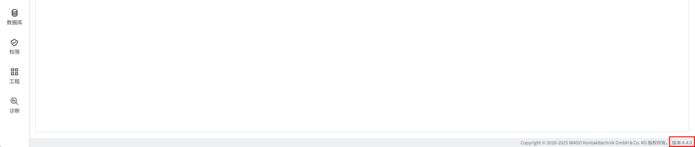
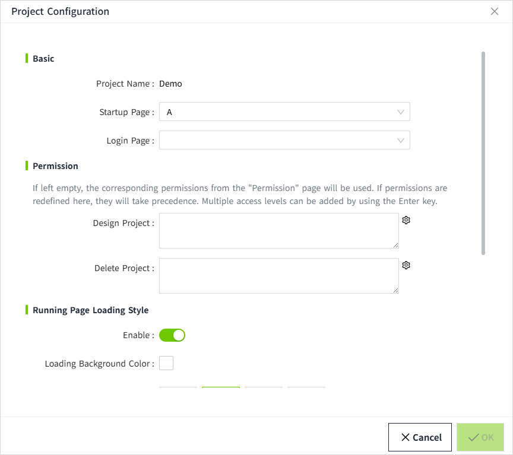

# Breaking Changes

## Breaking changes in 4.2

#### Breaking Change 1: Permissions are no longer set on roles

- **Impact** : Users with a role other than Admin.Some menus or functions may not be visible or accessible.
- **Change** : From version 4.2,permissions are no longer set on roles. Instead, permissions are managed through the Access Level and Permission pages.
- **Solution** : Log in with an Admin account, create roles under Access Level.



Configure permissions under the Permission page.



 Please refer to: **Management->Paltform->Security->Permission**，**Management->Paltform->Security->Access Level**

 #### Breaking Change 2: Permission control added for project creation

- **Impact** : Users without Admin or Configurator roles.
- **Change** : From version 4.2, only Admin or Configurator roles can create, copy, or import projects.
- **Solution** : Use an Admin account to create roles and grant project creation permission under Permission >Create Project Permission.



 Please refer to: **Management->Paltform->Security->Permission**

#### Breaking Change 3: Permission control for designing/deleting projects

- **Impact** : Users without Admin,Configurator, or Operator roles.
- **Change** : From version 4.2, by default only users with the role Admin, Configurator or Operator have permission to design and delete projects. Other users cannot perform these operations.
- **Solution** :  If a user needs design and delete permissions for a project, log in with a user account with the role Admin.
   -  Use an Admin account to create a new role under Access Level.
   -  Open the desired project in the editor.
   -  In the editor's settings, assign design and delete permissions for the role.


 Please refer to: **2D Visualization->Project Properties**

#### Breaking Change 4: Bezier curve removed

- **Impact** : Pages using the b ezier curve.
- **Change** : From version 4.2 ， Bezier curve removed from the tools.
- **Solution** : Use lines and arcs to replicate similar visuals.

#### Breaking Change 5: Sector control removed

- **Impact** : Pages using the sector control.
- **Change** : From version 4.2 ， Sector control removed from the tools.
- **Solution** : Design the shape externally and upload it as an image.

#### Breaking Change 6: XY chart control removed

- **Impact** : Pages using XY charts.
- **Change** : From version 4.2 ， XY chart removed from the tools.
- **Solution** : Use a custom chart control to replicate XY chart behavior.

#### Breaking Change 7: Scatter chart control removed

- **Impact** : Pages using scatter charts.
- **Change** : From version 4.2 ， Scatter chart removed from the tools.
- **Solution** : Use a custom chart control to simulate scatter plots.

#### Breaking Change 8: Custom tabs no longer supported in real-time/historical event controls

- **Impact** : Real-time and historical event controls.
- **Change** : From version 4.2 ， Custom tabs will no longer be shown after upgrade.
- **Solution** : Use the control’s filter conditions to perform custom queries at runtime.

#### Breaking Change 9: OPC UA device changes

- **Impact** : OPC UA devices.
- **Change** : From version 4.2, added discovery services and advanced group settings, which may caused previously connected devices to no longer function properly.
- **Solution** : Delete and recreate devices and groups.

 Please refer to：**Management->Devices-> OPC UA**

#### Breaking Change 10: Alarm table refactored

- **Impact** : Alarm history data query.
- **Change** : From version 4.2，new structure for alarm history table. After upgrading the old version to version 4.2, the history alarm control cannot query the history alarm data before the upgrade.
- **Solution** : Use the database management tool to open the corresponding database and execute the following script according to the database type.

**Note:**
 In versions prior to 4.2, the alarm acknowledgment mode was not stored in the database. Therefore, after synchronizing alarm data using the following script, all alarm acknowledgment modes will beset to "Automatic" by default.

**SQLite**

```sql
INSERT INTO ScadaAlarmHistoryData (
    EventId,
    Name,
    Type,
    Priority,
    State,
    Operator,
    NormalizedOperator,
    AckNotes,
    Description,
    AckMode,
    AckTime,
    Value,
    EventTime,
    Path,
    NormalizedName,
    ValueType,
    NodeName,
    StorageName,
    AssetName
)
SELECT
    a.EventId,
    a.Name,
    a.Type,
    a.Priority,
    CASE
        WHEN a.State = 1 THEN 9
        WHEN a.State = 2 THEN 5
        WHEN a.State = 3 THEN 10
        ELSE 6
    END AS State,
    a.Operator,
    a.NormalizedOperator,
    a.AckNotes,
    a.Description,
    0 AS AckMode,
    a.AckTime,
    CASE
        WHEN d.Type = 1 THEN a.IntegerVal
        WHEN d.Type = 2 THEN a.StringVal
        WHEN d.Type = 3 THEN a.DoubleVal
        WHEN d.Type = 4 THEN a.BoolVal
        ELSE a.DateTimeVal
    END AS Value,
    strftime('%Y-%m-%d %H:%M:%f', a."Timestamp" / 1000.0, 'unixepoch') AS EventTime,
    c.Alarm AS "Path",
    c.NormalizedName,
    d."Type" AS ValueType,
    b.Node AS NodeName,
    b.Provider AS StorageName,
    substr(c.Alarm, 1, instr(c.Alarm, ':') - 1) AS AssetName
FROM ScadaAlarmHistory a
INNER JOIN ScadaProviderMapping b ON a.ProviderId = b.Id
INNER JOIN ScadaAlarmMapping c ON a.AlarmId = c.Id AND a.ProviderId = c.ProviderId
INNER JOIN ScadaTagMapping d ON c.TagId = d.Id AND c.ProviderId = d.ProviderId AND c.Type = d.Type;
```
 
**SQL Server**

```sql
INSERT INTO ScadaAlarmHistoryData (
    EventId,
    Name,
    Type,
    Priority,
    State,
    Operator,
    NormalizedOperator,
    AckNotes,
    Description,
    AckMode,
    AckTime,
    Value,
    EventTime,
    Path,
    NormalizedName,
    ValueType,
    NodeName,
    StorageName,
    AssetName
)
SELECT
    a.EventId,
    a.Name,
    a.Type,
    a.Priority,
    CASE
        WHEN a.State = 1 THEN 9
        WHEN a.State = 2 THEN 5
        WHEN a.State = 3 THEN 10
        ELSE 6
    END AS State,
    a.Operator,
    a.NormalizedOperator,
    a.AckNotes,
    a.Description,
    0 AS AckMode,
    a.AckTime,
    CASE
        WHEN d.Type = 1 THEN CAST(a.IntegerVal AS NVARCHAR)
	    WHEN d.Type = 2 THEN CAST(a.StringVal AS NVARCHAR)
	    WHEN d.Type = 3 THEN CAST(a.DoubleVal AS NVARCHAR)
            WHEN d.Type = 4 THEN CASE WHEN a.BoolVal = 1 THEN 'True' ELSE 'False' END
	    ELSE CAST(a.DateTimeVal AS NVARCHAR)
    END AS Value,
    DATEADD(MILLISECOND, a.Timestamp % 1000, DATEADD(SECOND, a.Timestamp / 1000, '19700101 00:00:00:000')) AS EventTime,
    c.Alarm AS Path,
    c.NormalizedName,
    d.Type AS ValueType,
    b.Node AS NodeName,
    b.Provider AS StorageName,
    SUBSTRING(c.Alarm, 1, CHARINDEX(':', c.Alarm) - 1) AS AssetName
FROM ScadaAlarmHistory a
INNER JOIN ScadaProviderMapping b ON a.ProviderId = b.Id
INNER JOIN ScadaAlarmMapping c ON a.AlarmId = c.Id AND a.ProviderId = c.ProviderId
INNER JOIN ScadaTagMapping d ON c.TagId = d.Id AND c.ProviderId = d.ProviderId AND c.Type = d.Type;
```
 
**My SQL**

```sql
INSERT INTO ScadaAlarmHistoryData (
    EventId,
    Name,
    Type,
    Priority,
    State,
    Operator,
    NormalizedOperator,
    AckNotes,
    Description,
    AckMode,
    AckTime,
    Value,
    EventTime,
    Path,
    NormalizedName,
    ValueType,
    NodeName,
    StorageName,
    AssetName
)
SELECT
    a.EventId,
    a.Name,
    a.Type,
    a.Priority,
    CASE
        WHEN a.State = 1 THEN 9
        WHEN a.State = 2 THEN 5
        WHEN a.State = 3 THEN 10
        ELSE 6
    END AS State,
    a.Operator,
    a.NormalizedOperator,
    a.AckNotes,
    a.Description,
    0 AS AckMode,
    a.AckTime,
    CASE
        WHEN d.Type = 1 THEN a.IntegerVal
        WHEN d.Type = 2 THEN a.StringVal
        WHEN d.Type = 3 THEN a.DoubleVal
        WHEN d.Type = 4 THEN CASE WHEN a.BoolVal = 1 THEN 'True' ELSE 'False' END
        ELSE a.DateTimeVal
    END AS Value,
    DATE_FORMAT(FROM_UNIXTIME(a.Timestamp / 1000), '%Y-%m-%d %H:%i:%s.%f')  AS EventTime,
    c.Alarm AS Path,
    c.NormalizedName,
    d.Type AS ValueType,
    b.Node AS NodeName,
    b.Provider AS StorageName,
    SUBSTRING_INDEX(c.Alarm, ':', 1) AS AssetName
FROM ScadaAlarmHistory a
INNER JOIN ScadaProviderMapping b ON a.ProviderId = b.Id
INNER JOIN ScadaAlarmMapping c ON a.AlarmId = c.Id AND a.ProviderId = c.ProviderId
INNER JOIN ScadaTagMapping d ON c.TagId = d.Id AND c.ProviderId = d.ProviderId AND c.Type = d.Type;

```
 
**PostgreSQL**

```sql
INSERT INTO public."ScadaAlarmHistoryData" (
    "EventId",
    "Name",
    "Type",
    "Priority",
    "State",
    "Operator",
    "NormalizedOperator",
    "AckNotes",
    "Description",
    "AckMode",
    "AckTime",
    "Value",
    "EventTime",
    "Path",
    "NormalizedName",
    "ValueType",
    "NodeName",
    "StorageName",
    "AssetName"
)
SELECT
    a."EventId",
    a."Name",
    a."Type",
    a."Priority",
    CASE
        WHEN a."State" = 1 THEN 9
        WHEN a."State" = 2 THEN 5
        WHEN a."State" = 3 THEN 10
        ELSE 6
    END AS "State",
    a."Operator",
    a."NormalizedOperator",
    a."AckNotes",
    a."Description",
    0 AS "AckMode",
    a."AckTime",
CASE
    WHEN d."Type" = 1 THEN CAST(a."IntegerVal" AS VARCHAR)
    WHEN d."Type" = 2 THEN a."StringVal"
    WHEN d."Type" = 3 THEN CAST(a."DoubleVal" AS VARCHAR)
    WHEN d."Type" = 4 THEN INITCAP(CAST(a."BoolVal" AS VARCHAR))
    ELSE CAST(a."DateTimeVal" AS VARCHAR) 
END AS "Value",
    (TO_TIMESTAMP(a."Timestamp" / 1000) + (a."Timestamp" % 1000) * INTERVAL '1 millisecond') AT TIME ZONE 'UTC' AS EventTime,
    c."Alarm" AS "Path",
    c."NormalizedName",
    d."Type" AS "ValueType",
    b."Node" AS "NodeName",
    b."Provider" AS "StorageName",
    split_part(c."Alarm", ':', 1) AS "AssetName"
FROM public."ScadaAlarmHistory" a
INNER JOIN public."ScadaProviderMapping" b ON a."ProviderId" = b."Id"
INNER JOIN public."ScadaAlarmMapping" c ON a."AlarmId" = c."Id" AND a."ProviderId" = c."ProviderId"
INNER JOIN public."ScadaTagMapping" d ON c."TagId" = d."Id" AND c."ProviderId" = d."ProviderId" AND c."Type" = d."Type";

```
 
#### Breaking Change 11: Camera devices require WebRTC Streamer

- **Impact** : Camera devices.
- **Change** : From version 4.2, cameras must now be added under a WebRTC Streamer.
- **Solution** : Deploy WebRTC Streamer,then create and configure cameras under it.


#### Breaking Change 12: Camera control requires re-selection

- **Impact** : Camera controls on pages.
- **Change** : Because the way to add Camera devices has changed since version 4.2, you need to re-select the device you need to play on the camera control. And the runtime no longer supports switching devices and no longer supports the playback of history videos.
- **Solution** : Re-select the camera device in the editor.


#### Breaking Change 13: System.Tag.readHistory function parameters updated

- **Impact** : All scripts using this function.
- **Change** : From version 4.2, a new aggregate mode query has been added to the parameters of the** System.Tag.readHistory**  function, supporting the return of query results by  a fixed number of points.
- **Solution** : Existing code runs, but editing will show errors. Update parameter format accordingly.

 Please refer to:**Appendix->System Functions->System.Tag->System.Tag.readHistory**

#### BreakingChange 14: Beckhoff driver removed

- **Impact** : Devices using the Beckhoff driver.
- **Change** : From version 4.2, Beckhoff removed from device list.
- **Solution** : Use other drivers for data acquisition.

#### Breaking Change 15: System.UI.currentPage changed to System.Page

- **Impact** : Scripts using System.UI.currentPage.*
- **Change** : The System.UI.currentPage.* function has one more level relative to other functions. Starting from version 4.2, System.UI.currentPage is adjusted to System.Page 
- **Solution** : Rename System.UI.currentPage to System.Page in scripts.

 Please refer to: **Appendix->System Functions->System.Page->System.Page.getPropertyValue**, **Appendix->System Functions->System.Page->System.Page.setPropertyValue**

#### Breaking Change 16: System.UI.openPopup parameters modified

- **Impact** : Scripts using this function.
- **Change** : The parameter structure of the System.UI.openPopup function has been adjusted since version 4.2: 
   -  New **titleBar** parameteris added to set the title of the popup;
   -  The original parameter used to set the position of the popup window should be unified into the **options** object;
   -  The page Properties parameter that was originally passed in now needs to be unified into the **options** object.
- **Solution** : Old syntax works but shows warnings. Update to new format.

 Please refer to: **Appendix->System Functions->System.UI->System.UI.openPopup**

#### Breaking Change 17: In the script, the series under yAxis for realtime chart is changed to axes 

- **Impact** : Scripts modifying y-axis settings of realtime chart.
- **Change** : From version 4.2,series under yAxis is changed to axes. 
- **Solution** : Rename series to axes.

#### Breaking Change 18: In the script, the refreshRate parameter of the bar chart ismodified to refreshFrequency 

- **Impact** : Scripts modifying bar chart refresh rate.
- **Change** : From version 4.2,refreshRate is changed to refreshFrequency. 
- **Solution** : Rename refreshRate to refreshFrequency.

#### Breaking Change 19: In the script, barSpacing under bar chart series is adjusted tobarGap 

- **Impact** : Scripts modifying bar chart layout.
- **Change** : From version 4.2, barSpacing under series is changed to barGap.
- **Solution** : Rename barSpacing to barGap.

#### Breaking Change 20: In the script, the calendarBackgroundColor parameter of the **DatetimeInput** control is adjusted to pickerBackgroundColor. 

- **Impact** : Scripts modifying calendar background color.
- **Change** : From version 4.2,calendarBackgroundColor is changed to pickerBackgroundColor. 
- **Solution** : Rename calendarBackgroundColor to pickerBackgroundColor.

#### Breaking Change 21: Historical chart script parameters adjusted

- **Impact** : Scripts modifying historical chart properties.
- **Change** : From version 4.2, the following parameters have been adjusted.
   -  Button style parameter:
      - tagButton replaced with tagButtonColor
      - exportButton replaced with exportButtonColor
      - calendarButton replaced with calendarButtonColor
   - showCalendarButton replaced with showSearchButton
   - Removed cycle and unit from Data and migrated them to queryMode.
   - series in y Axis replaced with axes
- **Solution** : Update to match new structure.

#### Breaking Change 22: Pie chart parameter adjustments

- **Impact** : Scripts modifying pie chart properties.
- **Change** : From version 4.2, type changed to style； refreshRate changed to refreshFrequency.
- **Solution** : Update to new parameter names.

#### Breaking Change 23: Historical Data Table control parameter adjustments

- **Impact** : Scripts modifying historical data table control.
- **Change** : From version 4.2, the following adjustments have been made to the parameters:
   -  Removed showFilter,showCalendarButton, calendarButton
   -  Add showSearchButton,searchButton
   -  Remove font,fontSize,bold,italic,fontColor in search
   -  Remove name from data
   -  Remove sampling 
   -  Add queryMode
- **Solution** : Update to new structure.

#### Breaking Change 24: Gauge control rangeColor changed to intervalColor

- **Impact** : Scripts modifying gauge control.
- **Change** : From version 4.2,rangeColor is adjusted to intervalColor.
- **Solution** : Rename rangeColor to intervalColor.

#### Breaking Change 25: Dropdown control name under datasource changed to text

- **Impact** : Scripts modifying dropdown control.
- **Change** : From version 4.2, the name under datasource is adjusted to text
- **Solution** : Rename name to text.

#### Breaking Change 26: Radio button control name under datasource changed to text

- **Impact** : Scripts modifying radio button control.
- **Change** : Starting from version4.2, the name under datasource is adjusted to text
- **Solution** : Rename name to text.

#### Breaking Change 27: The response of the OpenAPI historical alarm api has been adjusted

- **Impact** : The third party applications integrates thehistorical  alarm api fo Open API.
- **Change** : Starting from version 4.2, the names of alarm types, alarm priorities, and alarm statuses have been updated.
- **Solution** : Update the alarm types, priorities, and statuses in your third-party application’s source code according to the mapping table below.

| **Original Type** | **Curent Type** |
|-------------------|-----------------|
| LimitHigh1        | H               |
| LimitHigh2        | H2              |
| LimitHigh3        | H3              |
| LimitHigh4        | H4              |
| LimitLow          | L               |
| LimitLow1         | L1              |
| LimitLow2         | L2              |
| LimitLow3         | L3              |
| LimitLow4         | L4              |
| RateChange        | RateOfChange    |

| **Original Priority** | **Current Priority** |
|-----------------------|----------------------|
| Mid                   | Medium               |
| Urgent                | Critical             |

| **Original Status** | **Current Status** |
|---------------------|--------------------|
| UnAck               | Active,Unacked     |
| Acked               | Active,Acked       |
| Rtnun               | Cleared,Unacked    |
| Norm                | Cleared,Acked      |

