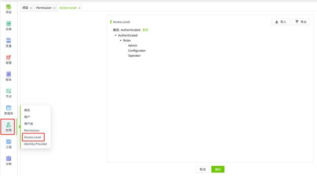
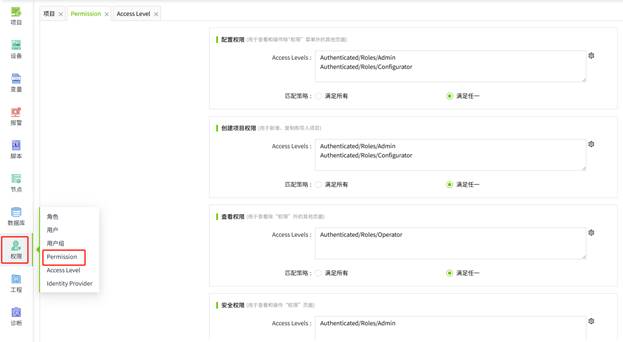

# Breaking Changes

#### Breaking changes in 4.2

###### **Breaking Change 1:    角色上不再进行权限设置。** 

- **影响范围** ：角色为非 Admin 的用户。这些用户登录后，可能会出现部分菜单不显示，或者部分功能无法使用的问题。
- **变更说明** ：从 4.2 版本开始，角色上不再设置权限。改为在 AccessLevel 页面维护权限。之后在 Permission 页面，对各个模块进行权限配置。
- **解决方案** ：请使用角色为 Admin 的用户账号登录，在 Access level 页面创建添加角色。



 添加角色后，在 Permission 页面，对相应功能模块进行权限配置。


 
 详见：[​Permission​](../management-platform/security/permission.md), [​Access Level​](../management-platform/security/access-level.md) 

###### **Breaking Change 2:   创建项目，增加了权限控制。**

- **影响范围** ：角色为 Admin 和 Configurator 之外的用户。
- **变更说明** ：从 4.2 版本开始，默认只有角色为 Admin 或 Configurator 的用户有权限进行项目的新增，复制和导入操作。其他用户无法执行这些操作。
- **解决方案** ：如果用户需要创建项目的权限，请使用角色为 Admin 的用户账号登录，在 Accesslevel 页面创建对应的角色，之后在 Permission 页面的 CreateProject Permission 配置项中，添加对应的角色。


 详见：[​Permission​](../management-platform/security/permission.md)

###### **Breaking Change 3:   设计和删除项目，增加了权限控制。**

- **影响范围** ：角色为 Admin ， Configurator 和 Operator 之外的用户。
- **变更说明** ：从 4.2 版本开始，默认只有角色为 Admin,Configurator 或 Operator 的用户有权限设计和删除项目。其他用户无法执行这些操作。
- **解决方案** ：如果用户需要项目的设计和删除权限，请使用角色为 Admin 的用户账号登录。
   -  首先在 Access level 页面创建对应的角色
   -  在项目列表中，点击需要设计权限的项目的设计按钮，进入编辑器
   -  点击编辑器的操作栏中的设置按钮，在弹窗中为“设计项目”和“删除项目”添加对应的 access level 。


 详见：[​项目属性​](../2d-visualization/project-properties/index.md)

###### **Breaking Change 4:   移除了贝塞尔曲线。**

- **影响范围** ：使用到了贝塞尔曲线的画面。
- **变更说明** ：从 4.2 版本开始，工具窗口中移除了贝塞尔曲线。如果画面上用到了这个控件，控件的对应区域将显示空白。
- **解决方案** ：您可以使用直线和弧线作为替代，绘制类似扇形的形状。

###### **Breaking Change 5:   移除了扇形控件。**

- **影响范围** ：使用到了扇形的画面。
- **变更说明** ：从 4.2 版本开始，工具窗口中移除了扇形控件。如果画面上用到了这个控件，控件的对应区域将显示空白。
- **解决方案** ：您可以在其他系统中绘制好贝塞尔曲线后，将其作为图片上传至WAGO VC Hub, 之后将图片添加到画面上。

###### **Breaking Change 6:   移除了 XY 曲线控件。**

- **影响范围** ：使用到了 XY 曲线的画面。
- **变更说明** ：从 4.2 版本开始，工具窗口中移除了 XY 曲线控件。如果画面上用到了这个控件，控件的对应区域将显示空白。
- **解决方案** ：您可以使用自定义图表控件绘制出 XY 曲线的效果。

###### **Breaking Change 7:   移除了散点图控件。**

- **影响范围** ：使用到了散点图的画面。
- **变更说明** ：从 4.2 版本开始，工具窗口中移除了散点图控件。如果画面上用到了这个控件，控件的对应区域将显示空白。
- **解决方案** ：您可以使用自定义图表控件绘制出散点图的效果。

###### **Breaking Change 8:   实时和历史事件控件，不再支持添加页签。**

- **影响范围** ：实时事件控件，历史事件控件。
- **变更说明** ：从 4.2 版本开始，实时和历史事件控件，不再支持添加自定义页签。如果用户在之前的版本上已经为事件控件设置了页签，升级到新版本后，控件上将不再显示用户自行添加的页签。
- **解决方案** ：用户在运行页面，在控件的筛选条件中，自定义条件后进行查询。

###### **Breaking Change 9: OPC UA设备添加了发现服务功能；组添加了高级配置。**  

- **影响范围：** OPC UA 设备。
- **变更说明：** 从4.2版本开始，OPC UA添加设备逻辑变化并且设备和组的数据结构也发生变化，导致之前的设备无法正常使用。
- **解决方案：** 删除旧设备，重新创建同名的设备和组。

     详见：[​OPC UA​ ](../management-platform/devices/opc-ua/index.md)

###### **Breaking Change 10: 报警表重构**

- **影响范围：** 报警历史数据查询
- **变更说明：** 在 4.2 版本上，重新设计了报警历史表，旧版本升级到 4.2 版本后，历史报警控件无法查询升级之前的历史报警数据。
- **解决方案：** 使用数据库管理工具打开对应数据库，依据数据库类型执行如下对应脚本即可。

 需要**说明** 的是，由于 4.2 之前的版本，报警的确认方式不是存储在数据库中的，所以通过以下脚本同步数据后，会将报警的确认方式全部设置为 “ 自动 ” 。

**SQLite**

```sql
INSERT INTO ScadaAlarmHistoryData (
    EventId,
    Name,
    Type,
    Priority,
    State,
    Operator,
    NormalizedOperator,
    AckNotes,
    Description,
    AckMode,
    AckTime,
    Value,
    EventTime,
    Path,
    NormalizedName,
    ValueType,
    NodeName,
    StorageName,
    AssetName
)
SELECT
    a.EventId,
    a.Name,
    a.Type,
    a.Priority,
    CASE
        WHEN a.State = 1 THEN 9
        WHEN a.State = 2 THEN 5
        WHEN a.State = 3 THEN 10
        ELSE 6
    END AS State,
    a.Operator,
    a.NormalizedOperator,
    a.AckNotes,
    a.Description,
    0 AS AckMode,
    a.AckTime,
    CASE
        WHEN d.Type = 1 THEN a.IntegerVal
        WHEN d.Type = 2 THEN a.StringVal
        WHEN d.Type = 3 THEN a.DoubleVal
        WHEN d.Type = 4 THEN a.BoolVal
        ELSE a.DateTimeVal
    END AS Value,
    strftime('%Y-%m-%d %H:%M:%f', a."Timestamp" / 1000.0, 'unixepoch') AS EventTime,
    c.Alarm AS "Path",
    c.NormalizedName,
    d."Type" AS ValueType,
    b.Node AS NodeName,
    b.Provider AS StorageName,
    substr(c.Alarm, 1, instr(c.Alarm, ':') - 1) AS AssetName
FROM ScadaAlarmHistory a
INNER JOIN ScadaProviderMapping b ON a.ProviderId = b.Id
INNER JOIN ScadaAlarmMapping c ON a.AlarmId = c.Id AND a.ProviderId = c.ProviderId
INNER JOIN ScadaTagMapping d ON c.TagId = d.Id AND c.ProviderId = d.ProviderId AND c.Type = d.Type;

```
 
**SQL Server**

```sql
INSERT INTO ScadaAlarmHistoryData (
    EventId,
    Name,
    Type,
    Priority,
    State,
    Operator,
    NormalizedOperator,
    AckNotes,
    Description,
    AckMode,
    AckTime,
    Value,
    EventTime,
    Path,
    NormalizedName,
    ValueType,
    NodeName,
    StorageName,
    AssetName
)
SELECT
    a.EventId,
    a.Name,
    a.Type,
    a.Priority,
    CASE
        WHEN a.State = 1 THEN 9
        WHEN a.State = 2 THEN 5
        WHEN a.State = 3 THEN 10
        ELSE 6
    END AS State,
    a.Operator,
    a.NormalizedOperator,
    a.AckNotes,
    a.Description,
    0 AS AckMode,
    a.AckTime,
    CASE
        WHEN d.Type = 1 THEN CAST(a.IntegerVal AS NVARCHAR)
	    WHEN d.Type = 2 THEN CAST(a.StringVal AS NVARCHAR)
	    WHEN d.Type = 3 THEN CAST(a.DoubleVal AS NVARCHAR)
            WHEN d.Type = 4 THEN CASE WHEN a.BoolVal = 1 THEN 'True' ELSE 'False' END
	    ELSE CAST(a.DateTimeVal AS NVARCHAR)
    END AS Value,
    DATEADD(MILLISECOND, a.Timestamp % 1000, DATEADD(SECOND, a.Timestamp / 1000, '19700101 00:00:00:000')) AS EventTime,
    c.Alarm AS Path,
    c.NormalizedName,
    d.Type AS ValueType,
    b.Node AS NodeName,
    b.Provider AS StorageName,
    SUBSTRING(c.Alarm, 1, CHARINDEX(':', c.Alarm) - 1) AS AssetName
FROM ScadaAlarmHistory a
INNER JOIN ScadaProviderMapping b ON a.ProviderId = b.Id
INNER JOIN ScadaAlarmMapping c ON a.AlarmId = c.Id AND a.ProviderId = c.ProviderId
INNER JOIN ScadaTagMapping d ON c.TagId = d.Id AND c.ProviderId = d.ProviderId AND c.Type = d.Type;

```
 
**MySQL**

```sql
INSERT INTO ScadaAlarmHistoryData (
    EventId,
    Name,
    Type,
    Priority,
    State,
    Operator,
    NormalizedOperator,
    AckNotes,
    Description,
    AckMode,
    AckTime,
    Value,
    EventTime,
    Path,
    NormalizedName,
    ValueType,
    NodeName,
    StorageName,
    AssetName
)
SELECT
    a.EventId,
    a.Name,
    a.Type,
    a.Priority,
    CASE
        WHEN a.State = 1 THEN 9
        WHEN a.State = 2 THEN 5
        WHEN a.State = 3 THEN 10
        ELSE 6
    END AS State,
    a.Operator,
    a.NormalizedOperator,
    a.AckNotes,
    a.Description,
    0 AS AckMode,
    a.AckTime,
    CASE
        WHEN d.Type = 1 THEN a.IntegerVal
        WHEN d.Type = 2 THEN a.StringVal
        WHEN d.Type = 3 THEN a.DoubleVal
        WHEN d.Type = 4 THEN CASE WHEN a.BoolVal = 1 THEN 'True' ELSE 'False' END
        ELSE a.DateTimeVal
    END AS Value,
    DATE_FORMAT(FROM_UNIXTIME(a.Timestamp / 1000), '%Y-%m-%d %H:%i:%s.%f')  AS EventTime,
    c.Alarm AS Path,
    c.NormalizedName,
    d.Type AS ValueType,
    b.Node AS NodeName,
    b.Provider AS StorageName,
    SUBSTRING_INDEX(c.Alarm, ':', 1) AS AssetName
FROM ScadaAlarmHistory a
INNER JOIN ScadaProviderMapping b ON a.ProviderId = b.Id
INNER JOIN ScadaAlarmMapping c ON a.AlarmId = c.Id AND a.ProviderId = c.ProviderId
INNER JOIN ScadaTagMapping d ON c.TagId = d.Id AND c.ProviderId = d.ProviderId AND c.Type = d.Type;

```
 
**PostgreSQL**

```sql
INSERT INTO public."ScadaAlarmHistoryData" (
    "EventId",
    "Name",
    "Type",
    "Priority",
    "State",
    "Operator",
    "NormalizedOperator",
    "AckNotes",
    "Description",
    "AckMode",
    "AckTime",
    "Value",
    "EventTime",
    "Path",
    "NormalizedName",
    "ValueType",
    "NodeName",
    "StorageName",
    "AssetName"
)
SELECT
    a."EventId",
    a."Name",
    a."Type",
    a."Priority",
    CASE
        WHEN a."State" = 1 THEN 9
        WHEN a."State" = 2 THEN 5
        WHEN a."State" = 3 THEN 10
        ELSE 6
    END AS "State",
    a."Operator",
    a."NormalizedOperator",
    a."AckNotes",
    a."Description",
    0 AS "AckMode",
    a."AckTime",
CASE
    WHEN d."Type" = 1 THEN CAST(a."IntegerVal" AS VARCHAR)
    WHEN d."Type" = 2 THEN a."StringVal"
    WHEN d."Type" = 3 THEN CAST(a."DoubleVal" AS VARCHAR)
    WHEN d."Type" = 4 THEN INITCAP(CAST(a."BoolVal" AS VARCHAR))
    ELSE CAST(a."DateTimeVal" AS VARCHAR) 
END AS "Value",
    (TO_TIMESTAMP(a."Timestamp" / 1000) + (a."Timestamp" % 1000) * INTERVAL '1 millisecond') AT TIME ZONE 'UTC' AS EventTime,
    c."Alarm" AS "Path",
    c."NormalizedName",
    d."Type" AS "ValueType",
    b."Node" AS "NodeName",
    b."Provider" AS "StorageName",
    split_part(c."Alarm", ':', 1) AS "AssetName"
FROM public."ScadaAlarmHistory" a
INNER JOIN public."ScadaProviderMapping" b ON a."ProviderId" = b."Id"
INNER JOIN public."ScadaAlarmMapping" c ON a."AlarmId" = c."Id" AND a."ProviderId" = c."ProviderId"
INNER JOIN public."ScadaTagMapping" d ON c."TagId" = d."Id" AND c."ProviderId" = d."ProviderId" AND c."Type" = d."Type";
```
 
###### **Breaking Change 11: 通过 WebRTC Streamer 配置摄像头**

- **影响范围** ： Camera 设备
- **变更说明** ：从 4.2 版本开始，不再支持直接添加 Camera 设备，需先创建 WebRtc-Streamer ，之后在 WebRtc-Streamer 下创建 camera 设备。
- **解决方案** ：先部署 WebRtc-Streamer 服务，在 Camera 列表中创建 WebRtc-Streamer 。将原来的 camera 设备的 Rtsp 地址填写到对应的 WebRtc-Streamer 下，之后在 WebRtc-Streamer 下创建 camera 。

 详见：[Camera](../management-platform/devices/camera/index.md) 
 
###### **Breaking Change 12: 由于创建 camera 的方式发生了变更， Camera 控件需重新选择 camera 设备后才能正常播放监控画面**

- **影响范围** ：画面上的 Camera 控件
- **变更说明** ：因为从 4.2 版本开始， Camera 设备的添加方式发生了变化，所以需要在 camera 控件上重新选择需要播放的设备。且运行时不再支持切换设备，不再支持历史视频的播放。
- **解决方案** ：在编辑画面上，为  camera 控件上重新选择 camera 设备。

 详见：[Camera](../management-platform/devices/camera/index.md) 

###### **Breaking Change 13: System.Tag.readHistory函数，添加了新的参数**

- **影响范围** ：使用了 System.Tag.readHistory 函数的所有地方
- **变更说明** ：从 4.2 版本开始，在 System.Tag.readHistory 函数的参数中，添加了新的聚合模式查询，支持按固定点数返回查询结果。
- **解决方案** ：  4.2 之前版本上的 System.Tag.readHistory 函数可以正常运行。但是在重新编辑使用了该函数的脚本时，会提示 System.Tag.readHistory 函数不正确。需要用户按照新的参数格式，对原有格式进行手动调整。

 详见：[​System.Tag.readHistory​ ](../appendix/system-function/system-tag/system-tag-readhistory.md)

###### **Breaking Change 14: 设备列表中移除了倍福**

- **影响范围** ：使用倍福驱动进行数采的设备
- **变更说明** ：从 4.2 版本开始，设备列表中移除了倍福驱动。
- **解决方案：** 使用其他驱动，进行数据采集。

###### **Breaking Change 15: 系统函数 System.UI.currentPage 调整为 System.Page**

- **影响范围** ：画面中使用到 System.UI.currentPage.* 相关函数的脚本
- **变更说明** ： System.UI.currentPage.* 函数相对其他函数多一个层级。从 4.2 版本开始， System.UI.currentPage 调整为 System.Page
- **解决方案：** System.UI.currentPage.* 函数执行不会出错，但在脚本编辑器中会提示错误，需要将命名空间修改为 System.Page

 详见：[​System.Page.setPropertyValue​](../appendix/system-function/system-page/system-page-setpropertyvalue.md) ,[​System.Page.getPropertyValue​](../appendix/system-function/system-page/system-page-getpropertyvalue.md) 

###### **Breaking Change 16: 系统函数System.UI.openPopup参数修改**

- **影响范围：** 画面中使用到 System.UI.openPopup 相关函数的脚本
- **变更说明：** 从 4.2 版本开始 System.UI.openPopup 函数的参数结构进行了调整：
   -  新增 titleBar 参数用于设置弹窗标题；
   -  原本用于设置弹窗位置参数需统一放入 options 对象中；
   -  原先传入的页面参数 pageProperties 现在需统一放入 options 对象中。
- **解决方案：** 原写法在执行时仍可正常弹出窗口，但在脚本编辑器中会提示错误，需要按新格式修改。

 详见：[​System.UI.openPopup​ ](../appendix/system-function/system-ui/system-ui-openpopup.md)

###### **Breaking Change 17: 脚本中，实时趋势的 yAxis 下的 series  修改为  axes**

- **影响范围** ：画面中通过脚本对到实时趋势的 y 轴进行修改的地方。
- **变更说明** ：从 4.2 版本开始 ,yAxis 下的 series  修改为  axes 
- **解决方案** ：脚本执行不会出错，但在脚本编辑器中会提示错误，需要手动将属性名称由  series  修改为 axes 。

###### **Breaking Change 18: 脚本中，柱状图的 refreshRate 参数修改为 refreshFrequency**
- **影响范围** ：画面中通过脚本修改柱状图刷新频率的地方。
- **变更说明** ：从 4.2 版本开始 ,refreshRate 修改为 refreshFrequency
- **解决方案** ：脚本执行不会出错，但在脚本编辑器中会提示错误，需要手动将属性名称由  refreshRate  修改为 refreshFrequency 。

###### **Breaking Change 19: 脚本中，柱状图 series 下的  barSpacing  调整为  barGap**

- **影响范围** ：画面中通过脚本对柱状图的系列进行修改的地方。
- **变更说明** ： 从 4.2 版本开始 ,series 下的  barSpacing  调整为  barGap
- **解决方案** ：脚本执行不会出错，但在脚本编辑器中会提示错误，需要手动将属性名称由 barSpacing  修改为  barGap 。

###### **Breaking Change 20: 脚本中，日历控件的 calendarBackgroundColor 参数调整为pickerBackgroundColor**

- **影响范围** ：画面中通过脚本修改日历控件的背景色的地方。   
- **变更说明** ：从 4.2 版本开始 ,calendarBackgroundColor 调整为 pickerBackgroundColor
- **解决方案** ：脚本执行不会出错，但在脚本编辑器中会提示错误，需要手动将属性名称由  calendarBackgroundColor  修改为  pickerBackgroundColor 。

###### **Breaking Change 21: 通过脚本操作历史趋势图时，部分参数做了调整。**

- **影响范围** ：画面中通过脚本修改历史趋势图属性的地方。
- **变更说明** ：从 4.2 版本开始 , 对如下参数进行了调整。
   -  按钮样式参数：
      -  tagButton 替换为 tagButtonColor
      -  exportButton 替换为 exportButtonColor
      -  calendarButton 替换为 calendarButtonColor
   -  showCalendarButton 替换为 showSearchButton
   -  Data 中移除 cycle 和 unit ，迁移至 queryMode 中
   -  yAxis 中的 series 替换为 axes
- **解决方案** ：原写法在执行时仍然会按照预期结果执行成功，但在脚本编辑器中会提示错误，需要按照新格式进行修改。

###### **Breaking Change 22: 通过脚本操作饼图时，部分参数做了调整。**

- **影响范围：** 画面中通过脚本修改饼图属性的地方。
- **变更说明：** 从 4.2 版本开始， type 改为 style ； refreshRate 改为 refreshFrequency
- **解决方案** ：原写法在执行时仍然会按照预期结果执行成功，但在脚本编辑器中会提示错误，需要按新格式修改。

###### **Breaking Change 23: 通过脚本操作历史检索控件时，部分参数做了调整。**

- **影响范围：** 画面中通过脚本修改历史检索控件属性的地方。
- **变更说明** ：从 4.2 版本开始，对参数进行了如下调整：
   -  移除 showFilter ， showCalendarButton ， calendarButton
   -  新增 showSearchButton ， searchButton
   -  移除 search 中的 font,fontSize,bold,italic,fontColor
   -  移除 data 中 name
   -  移除 sampling 
   -  新增 queryMode
- **解决方案** ：原写法在执行时仍然会按照预期结果执行成功，但在脚本编辑器中会提示错误，需要按新格式修改。

###### **Breaking Change 24: 通过脚本操作仪表盘控件时，部分参数做了调整。**

- **影响范围** ：画面中通过脚本修改仪表盘控件属性的地方。
- **变更说明** ： 从 4.2 版本开始， rangeColor 调整为 intervalColor 。
- **解决方案** ：原写法在执行时仍然会按照预期结果执行成功，但在脚本编辑器中会提示错误，需要按新格式修改。

###### **Breaking Change 25: 通过脚本操作下拉框控件时，部分参数做了调整。**

- **影响范围** ：画面中通过脚本修改下拉框控件属性的地方。
- **变更说明** ：从 4.2 版本开始， datasource 下的 name 调整为 text
- **解决方案** ：原写法在执行时仍然会按照预期结果执行成功，但在脚本编辑器中会提示错误，需要按新格式修改。

###### **Breaking Change 26: 通过脚本操作单选按钮时，部分参数做了调整。**

- **影响范围：** 画面中通过脚本修改单选按钮控件属性的地方。
- **变更说明：** 从 4.2 版本开始， datasource 下的 name 调整为 text
- **解决方案：** 原写法在执行时仍然会按照预期结果执行成功，但在脚本编辑器中会提示错误，需要按新格式修改。

###### **Breaking Change 27: OpenAPI历史报警接口返回值做了调整。**

- **影响范围** : 集成OpenAPI的历史报警接口的第三方应用程序
- **变更说明** : 从4.2版本开始，报警类型、等级、状态做了调整
- **解决方案** : 在第三应用程序集成SCADA报警的代码中将报警类型、等级、状态按照下面的对照表进行调整

| 原类型     | 现类型       |
|:----------|:-------------|
| LimitHigh1 | H            |
| LimitHigh2 | H2           |
| LimitHigh3 | H3           |
| LimitHigh4 | H4           |
| LimitLow   | L            |
| LimitLow1  | L1           |
| LimitLow2  | L2           |
| LimitLow3  | L3           |
| LimitLow4  | L4           |
| RateChange | RateOfChange |

| 原等级 | 现等级   |
|：--------|：----------|
| Mid    | Medium   |
| Urgent | Critical |

| 原状态 | 现状态          |
|：--------|：-----------------|
| UnAck  | Active,Unacked  |
| Acked  | Active,Acked    |
| Rtnun  | Cleared,Unacked |
| Norm   | Cleared,Acked   |
