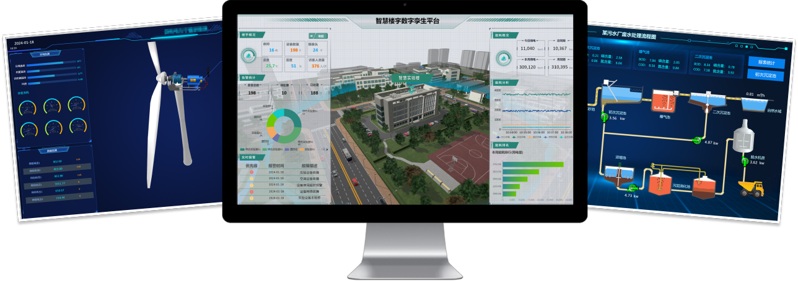
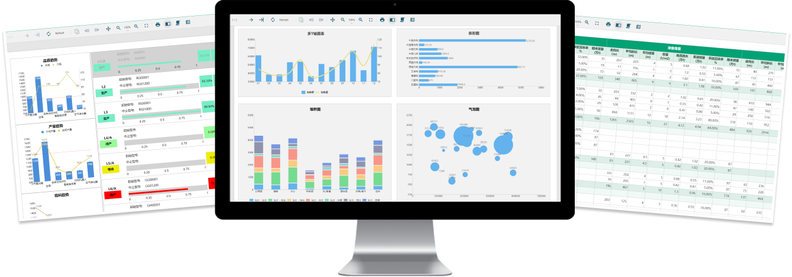
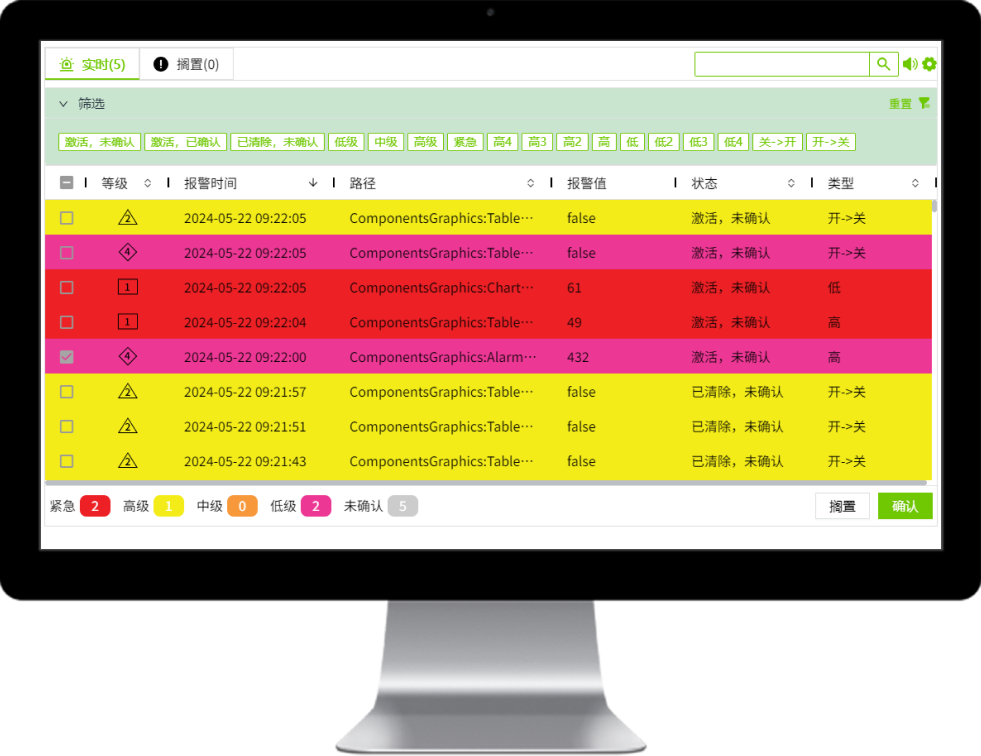
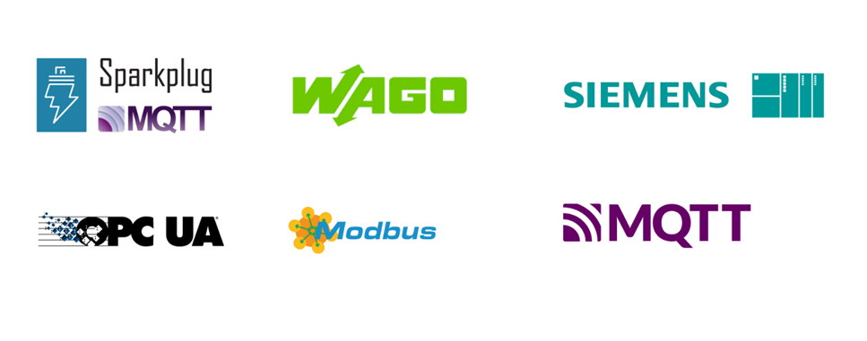

 # 产品概述

#### 什么是WAGO VC Hub?

WAGO VC Hub是由WAGO开发和销售的一款VC Hub产品。其完全基于现代化Web技术开发实现，这使得您能够轻松使用WAGO VC Hub快速构建各种复杂的现场组态应用。不管在本地还是云端，WAGO VC Hub允许您从任何地点实时监测和控制整个工业过程，确保生产过程的连续性，提高生产效率。WAGO VC Hub更支持规模庞大的现场组态项目，使您能收集大量工业现场数据，并通过WAGO VC Hub内置的报表工具获取深入的洞察，有助于进一步优化生产决策。不受限制的用户数量和设备连接数量，使WAGO VC Hub成为适用于各种规模的工业组态项目经济实惠的选择。

WAGO VC Hub致力于为您的工业组态现场提供高效便捷的解决方案。

#### WAGO VC Hub的特点

- 服务器安装：WAGO VC Hub只需要在一台服务器上进行安装，即可在各种浏览器中运行，极大降低了现场安装部署以及后期运维的难度。
- 所见即所得：WAGO VC Hub提供所见即所得的组态编辑器，所有组态过程提供实时反馈，在组态过程中可随时查看和测试自己的设计。
- 面向对象建模：WAGO VC Hub允许您基于工业现场物理模型构建监控点，完全以对象化的方式管理您的设备数据。
- 多维度历史数据：WAGO VC Hub支持市面上主流的各类关系型数据，同时也支持时序数据库，提供多维度的历史存储和处理机制。
- 云端部署：WAGO VC Hub的云端部署为您提供了高度灵活的选择，将监控和控制功能从边端扩展到云端，从而实现云边协同、远程访问、数据存储和协作，为您的工业操作带来更大的便捷性和可扩展性。
- 支持移动端：WAGO VC Hub支持移动端，使您能够随时随地通过智能手机和平板电脑等移动设备轻松访问监控和控制功能，以便更加实时地管理您的工业现场。
- 高可用：WAGO VC Hub支持主备高可用配置，确保系统的稳定性和可靠性，无论是通过备用服务器、冗余存储等机制，都能够持续提供实时监控和控制，以应对潜在的故障和维护需求，保障您的现场平稳运行。
- 高安全性：WAGO VC Hub提供了卓越的高安全性，通过支持HTTPS、加密存储以及证书配置等一系列功能，确保数据的机密性和完整性，从而提供了可信赖的工业组态解决方案。
- 灵活组网：WAGO VC Hub支持灵活组网，使其能够轻松扩展应用规模，确保您的工业应用能够随着需求的增长而无缝适应，并持续提供高效的监控和控制。
- 跨平台：WAGO VC Hub的完全跨平台特性使您能够轻松在不同操作系统和设备上实现统一的监控和控制，无惧任何现场部署条件。
- 国产化：WAGO VC Hub支持主流国产化操作系统和芯片，以满足国内客户的需求，为工业自动化提供更贴近本土的支持。
- 3D低代码数字孪生平台：WAGO VC Hub的低代码数字孪生平台结合了强大的数字化建模和低代码开发能力，让用户能够更容易创建数字孪生场景，模拟工业过程，并进行迅速的3D孪生应用开发，为工业自动化提供更快速的创新和响应能力。

#### 基于Web实现

WAGO VC Hub完全基于Web标准实现，所以您可以使用Web浏览器直接运行和操作您的VC Hub应用。比如，直接通过Web浏览器即可连接和配置PLC或者历史存储，您也可以直接使用Web浏览器组态您的VC Hub应用。基于Web标准的另一个好处是，可以使您的组态画面比传统桌面端的更易创建并且更为美观。

#### 高性能

得益于WAGO VC Hub现代化的设计架构和内建的高性能引擎，其可以实时监控数以万计甚至百万技的现场数据，并且进行存储和分析。

#### 报表

WAGO VC Hub内置在线报表设计器，通过拖拽即可完成报表的设计，报表数据可无缝对接VC Hub历史数据库以及企业的SQL数据库。内置丰富的报表控件，帮助用户轻松设计多种报表样式，可导出多种主流文件格式，包括：Excel、Word、PDF、HTML、图片、JSON。

#### 报警

WAGO VC Hub内建标准化的报警工具，您可以随时使用这些工具构建您的现场报警应用。所有报警可以实时显示和存储，您也可以随时确认和搁置报警。

#### 数据驱动

WAGO VC Hub支持多种数据协议，使您能轻松将现场数据接入WAGO VC Hub。并且我们也在不断增加和扩展这些数据协议，使WAGO VC Hub能应用到更广阔的领域。

