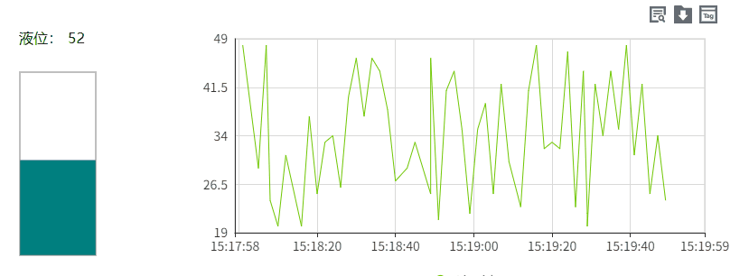

# 快速入门

我们概述了一些简单的步骤来指导您配置项目。您可以在短时间内，运行一个项目。                                                                                               

#### 1.创建项目

在项目列表中点击“新增“按钮来创建项目。

#### 2.添加数据库

WAGO VC Hub安装后会自动创建一个SQLite数据库，您可以使用该数据库进行入门测试。您也可以点击”数据库“->"数据库连接"页面的“新增“按钮来创建新的数据库连接。详见[数据库连接](../management-platform/databases/database-connection/index.md)。

#### 3.添加资产

WAGO VC Hub安装后会自动创建一个Default资产，您可以使用该资产进行入门测试。您也可以点击”变量“->"资产"页面的“新增“按钮来创建新的资产。详见[资产](../management-platform/assets-and-tags/asset/index.md)。

#### 4.打开编辑器

在项目列表页面，点击项目的”设计“按钮。

打开组态编辑器，显示如下界面。

#### 5.新建画面

点击”新建画面“，快速创建一个画面。

在设计器右侧的工具窗口中，在画面上添加”文本标签”,”值显示”,“矩形”，“历史趋势图”控件。

#### 6.创建变量

在组态编辑器的资产窗口的资产下拉框中选择一个资产，之后点击添加按钮，为该资产添加一个存变量。名称为：液位。

为该变量开启模拟属性，使用模拟值作为变量值。类型支持随机、递增、递减和固定。

#### 7.为变量开启历史记录

在变量的编辑页面顶部，开启历史记录，可以将该变量的值进行历史存储。详见[历史记录](../management-platform/assets-and-tags/tag/tag-properties/history.md)。

#### 8.绑定变量

为画面上的控件绑定变量。

1. 将文本标签的显示内容设置为：液位:

2. 在矩形的动画中，选择填充动画。点击值的绑定按钮，绑定已创建的变量：液位。

3. 在值显示控件中，点击值的绑定按钮，绑定已创建的变量：液位。绑定后，绑定图标会由灰色变为绿色。

4. 在历史趋势图上，绑定已创建的变量：液位。

#### 9.预览/运行

点击画面菜单栏中的预览按钮，查看预览效果。也可以在项目列表中，点击项目的运行按钮，查看运行页面。

