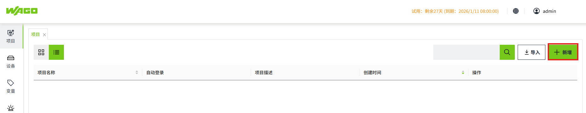
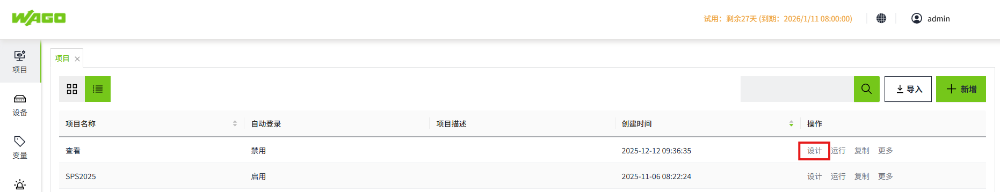
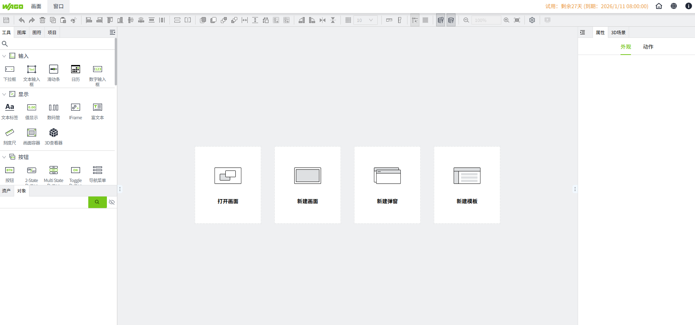
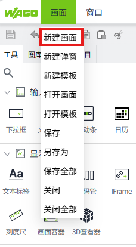
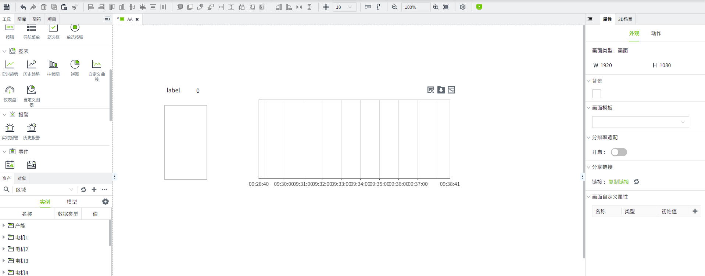
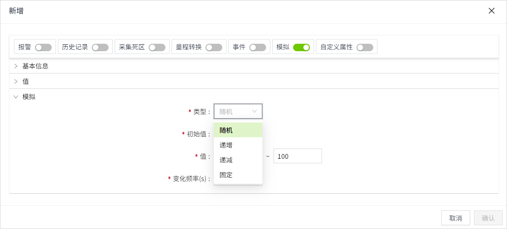
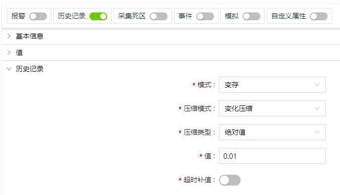
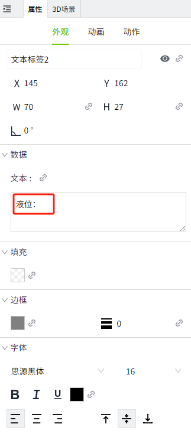
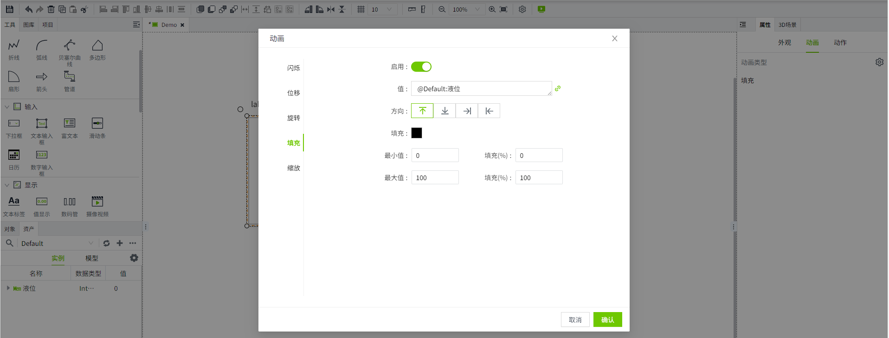
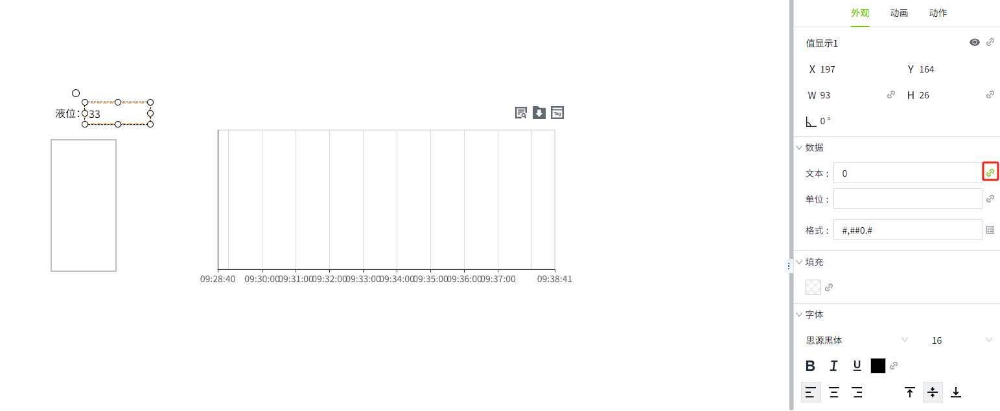

# Quick Start Guide

We have outlined some simple steps to guide you through configuring your project. You can run a project in a short amount of time.

## 1.Create a Project

Click the "Add" button in the project list to create a project.

## 2.Add a Database

After the installation of VC Hub, a SQLite database will be automatically created, which you can use for basic testing. You can also click "Database" -> "Database Connection" page and then click the "New" button to create a new database connection. 

## 3.Add Assets

After the installation of VC Hub, a default asset will be automatically created, which you can use for basic testing. You can also click "Tags" -> "Assets" page and then click the "New" button to create new assets.

## 4.Open the Editor

On the project list page, click the "Design" button for the project.

Open the configuration editor to display the following interface.

## 5.Create a New Page

Click "New Page" to quickly create a new page.

In the **Tools** window on the left side of the designer, add for example "Rect" , "Label" , "Value Display",and "Historical Trend Chart" controls to the page. You can also use the search functionality.

## 6.Create a Tag

In the asset dropdown box of the asset window in the configuration editor, select an asset and then click the add button to add a memory tag to that asset. Tag name: liquid.

Enable the simulated property for this tag, using simulated value as the tag value. Types supported are **Random**, **Increment**, **Decrement**, and **Fixed.**

## 7.Enable History for Tags

At the top of the tag editing page, enable history recording to store the value of the tag historically.

## 8.Bind Tag

Bind tags to controls on the page.

1. Set the display content of the text label to: "Liquid level:"
    
2.  In the animation of the rectangle, select the fill animation. Click the value binding button and bind the created tag:liquid.
    
3. In the value display control, click the value binding button and bind the created tag:liquid. Afte binding, the binding icon will turn from gray to green.
    
4. In the historical chart control, click the value binding button and bind the created tag:liquid. 
    
    
**Note:** For more information on binding, please refer to the Property Binding page. 

## 9.Preview/Run

Click the preview button in the page tool bar to view the preview effect. You can also click the run button for the project in the project list to view the running page.

