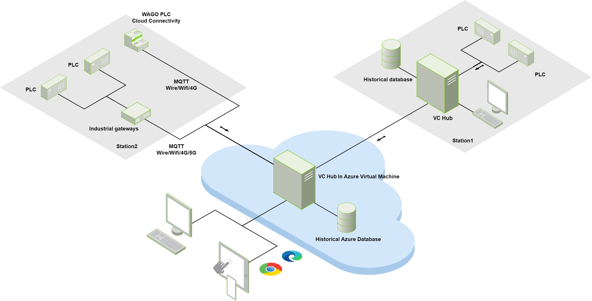
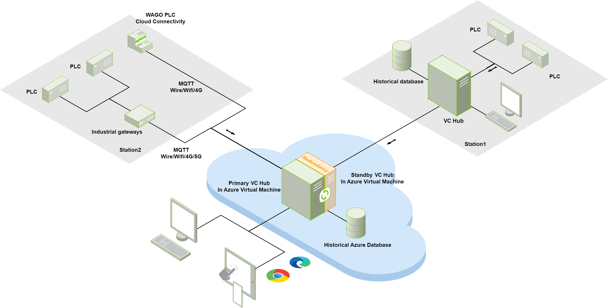
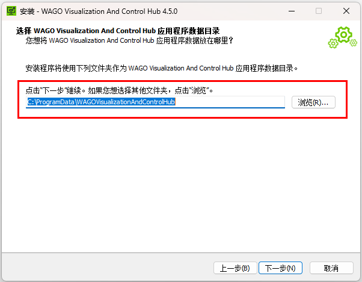
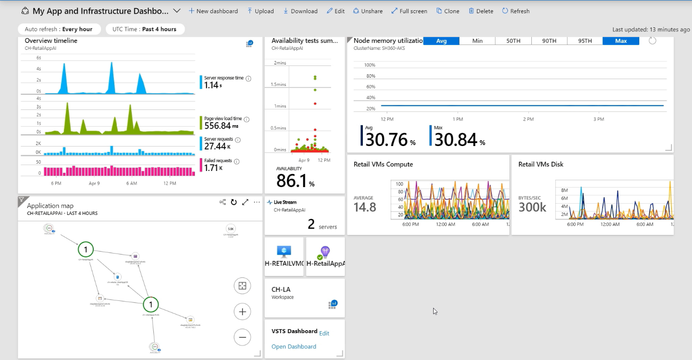

# Azure Cloud Deployment

## Introduction

This document primarily introduces how to deploy the VC Hub service based on Azure Virtual Machine, and how to enhance the availability, disaster recovery, and backup capabilities of the VC Hub service through the complementary services provided by Azure and the inherent capabilities of VC Hub.

We will start with the deployment of a single virtual machine and progressively describe how to deploy a reliable VC Hub system for different business scenarios.

## Environment Requirements

#### Hardware (Virtual Machine Configuration)

-  CPU: x86 64-bit architecture, 4 cores or above
-  Memory: 16GB
-  HardDrive: SSD or higher performance hard drive, with at least 10GB of available space

## Deployment Method

#### Single Virtual Machine Deployment

###### Overview

Subscribe to an Azure Virtual Machine with hardware configuration requirements and Azure Database service to proceed with cloud deployment in the future.

Currently, VC Hub supports the following Azure Database service types: Azure Database for MySQL, Azure Database for PostgreSQL, Azure SQL (SQL Server).

This method is only suitable for scenarios where system stability and disaster recovery capabilities are relatively low. The advantage lies in its simplicity of configuration.

###### Deployment architecture

The diagram below illustrates the single-machine deployment architecture of VC Hub based on Azure, where VC Hub can be directly installed on an Azure VM using an installation package.

We recommend users to subscribe directly to Azure Database service for storing VC Hub historical data (although VC Hub service also supports local database connection, users need to ensure the availability and backup of the database themselves for stability). After successfully subscribing to Azure Database, establish a connection with it through VC Hub's database connection feature.

For cloud-based VC Hub nodes, communication with device sites can be achieved via the MQTT protocol, as depicted with Station2 in the diagram. To establish MQTT communication, users need to enable port 1883 on Azure Virtual Machine. Cloud-based VC Hub communicates with device sites through port 1883, which is currently not customizable.

Users can utilize the built-in networking feature of VC Hub to establish communication between cloud-based VC Hub nodes and other VC Hub nodes, as shown with Station1 in the diagram. Station1 can be deployed in the cloud or locally, and users need to enable port 8060 on Azure Virtual Machine for communication. This port can be customized within the VC Hub website.

###### Service Level Agreements Analysis

As of 2024-04-01, Azure officially provides the following Uptime Calculation for reference in single-instance virtual machine scenarios:

 [Service Level Agreement for Microsoft Online Services (WW)](https://wwlpdocumentsearch.blob.core.windows.net/prodv2/OnlineSvcsConsolidatedSLA(WW)(English)(April2024)(CR).docx)

| Azure Virtual Machine | Standard SSD | Standard HDD | Database |
|-----------------------|--------------|--------------|----------|
| 99.9%                 | 99.5%        | 95%          | 99.9%    |

#### Dual Virtual Machine Active-Standby Deployment

###### Overview

In scenarios where a single virtual machine service may not meet the stability requirements, a dual Azure Virtual Machine setup can be employed to achieve high availability for the VC Hub service. It is recommended to subscribe to two Azure VMs deployed in different Availability Zones to increase availability to 99.99%.

Utilizing the redundancy configuration provided by the VC Hub service, establish connections between the two VC Hub services to form a primary-secondary setup. In the event of the primary virtual machine failure, the secondary virtual machine will immediately take over the data monitoring service, ensuring seamless transition from the user's perspective.

Simultaneously, both VC Hub nodes connect to the same Azure Database. Devices need to interact with both VC Hub nodes simultaneously via the MQTT protocol.

For local VC Hub nodes, they only need to configure networking connections with the primary VC Hub node in the cloud. In the event of primary node failure, the local VC Hub will automatically switch its connection to the backup VM.

###### Service Level Agreements Analysis

System stability is enhanced. In the event of a VM failure, the VC Hub service on the other VM will continue to monitor device data, providing sufficient time for fault handling.

| Across two or more availability zones in the same Azure region | In the same availability set or the same dedicated host group |
|----------------------------------------------------------------|---------------------------------------------------------------|
| 99.99%                                                         | 99.95%                                                        |

## Port Configuration

| Port | Function                  | Description                                                                                                                                   |
|------|---------------------------|-----------------------------------------------------------------------------------------------------------------------------------------------|
| 8066 | HTTP Service              | Provides the VC Hub HTTP service. Users can customize it during the installation process or modify it in the management platform.             |
| 8043 | HTTPS Service             | Provides the VC Hub HTTPS service. Users can customize it during the installation process or modify it in the management platform.            |
| 8060 | Networking and Redundancy | Used for communication in networking and redundancy functions. Default is 8060, which can be modified in the management platform by the user. |
| 1883 | MQTT Communication        | Used for MQTT communication between the cloud-based VC Hub system and devices. Currently does not support customization.                      |

## Data Backup And Restore

#### Overview

We recommend users to regularly back up important data within VC Hub. Users can choose to perform backups manually or automatically.

#### How to operate

###### Historical database

In the cloud deployment scenario, we recommend using Azure Database to store VC Hub historical data (including collected historical data and alarm history data). Azure Database also provides data backup functionality. Users can refer to the technical documentation provided by Azure, specifically [Change automated backup settings for  [Change automated backup settings for Azure SQL Database](https://learn.microsoft.com/en-us/azure/azure-sql/database/automated-backups-change-settings?view=azuresql-db&preserve-view=true&tabs=azure-portal), to configure regular backups for the VC Hub historical database.

When it comes to restoring historical data, Azure Database also offers an automatic recovery feature. You can refer to the documentation on how to  [Restore a database from a backup in Azure SQL Database](https://learn.microsoft.com/en-us/azure/azure-sql/database/recovery-using-backups?view=azuresql-db&tabs=azure-portal) for guidance on restoring data from backups in Azure SQL Database.

###### Application data directory

All data in VC Hub, apart from historical data, is stored in a fixed directory in the form of folders and files, known as the application data directory. This directory includes data such as projects, certificates, network settings, logs, and more.

Users can manually copy the application data directory to another storage device for backup purposes on a regular basis. When restoration is needed, users can manually stop the VC Hub service on Azure VM, replace the application data directory on Azure VM with the backup directory, and then restart the VC Hub service.

Azure provides the  [Azure Backup](https://azure.microsoft.com/en-us/products/backup) service, which allows for configuring automatic backups at regular intervals and provides cloud storage space. Azure Backup also offers restoration functionality, as detailed in  [Restore files to an Azure virtual machine](https://learn.microsoft.com/en-us/azure/backup/tutorial-restore-files) (Note: Before restoration, the VC Hub service still needs to be manually stopped).

The specific location of the application data directory can be configured during the installation process, as shown in the following image.

## Data Monitor

#### Overview

In a production environment, when Azure VM experiences a complete outage, system administrators typically receive abnormal report information. However, in some scenarios, it may be a specific service within the server that experiences an interruption, such as SCADA service or database service. In such cases, Azure Monitor can be introduced to monitor the performance of VC Hub and database services within the server.

System administrators can use the monitoring dashboard to observe the server's status, promptly receive alerts on abnormal states, and address issues. Additionally, they can configure Azure Backup to monitor backup failures and abnormalities.

By enabling the Azure Monitor agent in Azure VMs hosting VC Hub services, real-time data can be received in the Azure Monitor center.

#### Azure Monitor Url

 [Azure Monitor](https://azure.microsoft.com/en-us/products/monitor)

## Extension

This manual primarily describes how to deploy VC Hub using the cloud services provided by Azure. Similarly, we also support similar hosted virtual machine services, database services, backup services, and monitoring services from other cloud service providers such as AWS, Alibaba Cloud, Tencent Cloud, and others.
