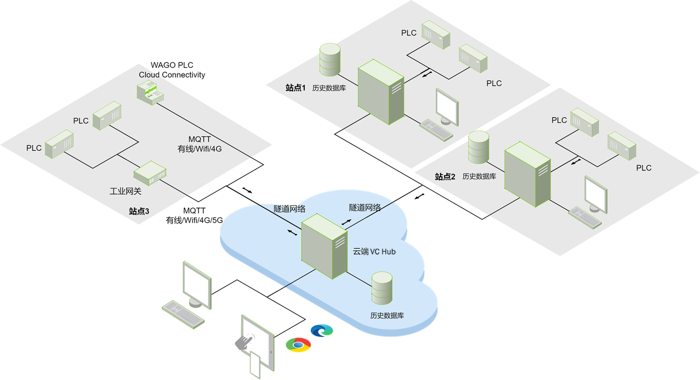
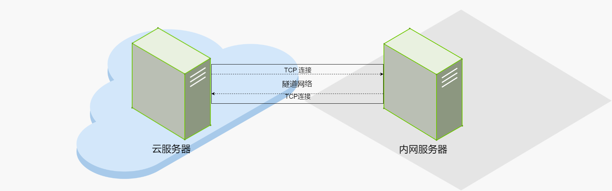
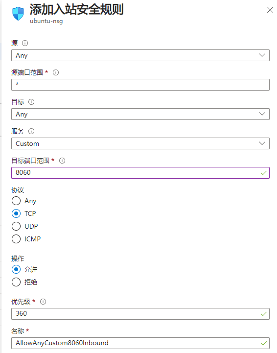

# Hybrid Cloud and Local Deployment

 A VC Hub  node deployed within a local area network can be networked with VC Hub  in the cloud. In the absence of a public IP address, nodes within a local area network can generally only create outbound connections from local area.

## **Tunnel Network**

 When the outbound connection is successfully connected, a tunnel network will be established between the two nodes. Through this tunnel network, the nodes in the local area network (LAN) and the nodes in the cloud can realize bi-directional access, even if the nodes in the LAN don't have a public IP, the nodes in the cloud are still able to send HTTP requests to the nodes in the LAN and read/write the data of the nodes in the LAN through the tunnel network.

## **Flow Control**

 The data collected between the nodes of the VC Hub grouping will not be synchronized in real time, and the cloud nodes will only send data requests to the nodes on the LAN when end users on the cloud nodes view the data from the remote nodes, and this on-demand subscription approach can effectively avoid sky-high bills on the cloud platform.

## **Note**

 Due to the complex network environment of the public network, the TCP connection of the group network may not be able to access the cloud node, especially the restriction of the firewall, so you need to pay attention to the following points when configuring the group network of the cloud edge:

1.  The server of cloud environment tries to use static IP, if there is no static IP, you can bind a domain name to the server.
2.  The server of the cloud platform will only open the port of HTTP service by default, and you need to open the port used for networking before networking.

    Take Azure as an example, you need to add inbound connection rules in the network management page of the virtual machine to open up the network port, and the default network port is 8060.
 
    

3.  LAN firewall outbound rules may also restrict the ports of non-HTTP services, LAN servers sending TCP connections to the public network with a target port of 8060 may be intercepted by the LAN local firewall, so you need to check with the LAN administrator to make sure that the ports used for networking are not blocked, and if blocked, you can apply for the opening of networking ports or change the networking ports of the cloud nodes.

