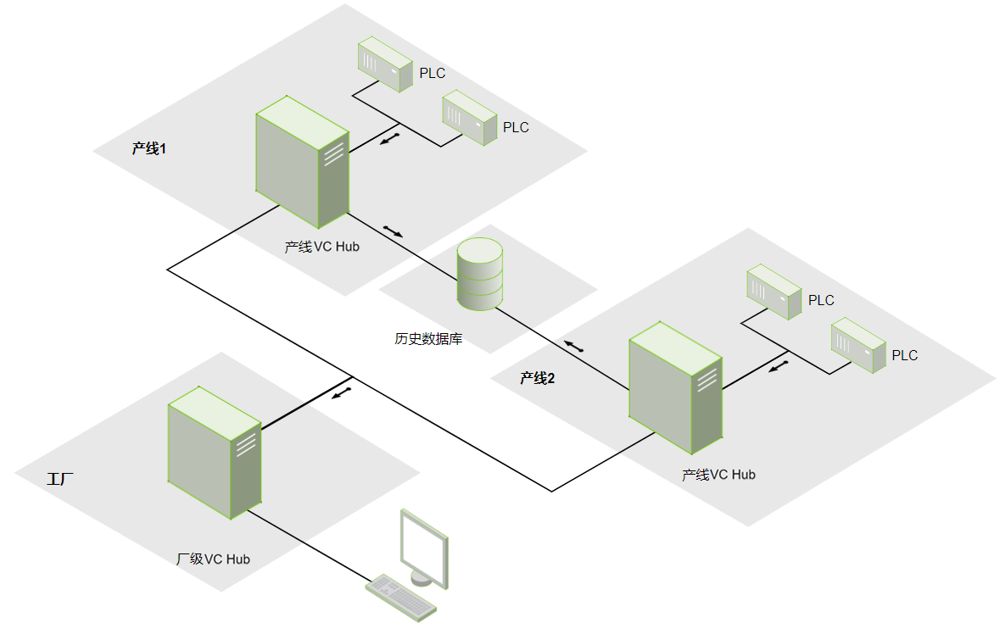

# Network Deployment

 In large-scale sites, a large amount of data needs to be collected, and usually a single VC Hub  server can not handle all the work. At this point, you need to install multiple VC Hub  servers on site and work together through networking to share these tasks.

## **Decentralization**

 In the networking architecture, each VC Hub  node is responsible for a portion of the overall system's work. If one of the servers fails , only this part of the system will be affected. You can also configure a corresponding redundant server for a single server, which will greatly improve the overall system availability.

## **Easy Expansion**

 Under this architecture, users can easily expand their servers. Because the system is deployed in a decentralized manner, adding new servers will not have an impact on the work of other servers. This allows for linear expansion of the entire architecture.

