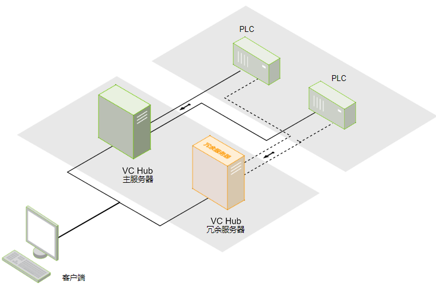
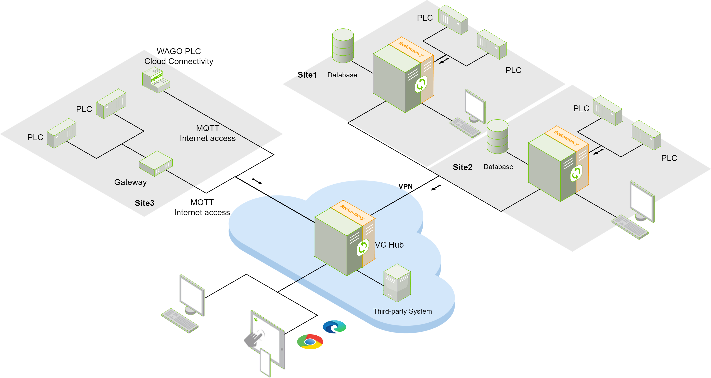

# Redundant Deployment

 In some critical site scenarios, you can increase system availability by adding redundant servers. If the primary server fails, the redundant server immediately takes over from the primary server to ensure system availability and data integrity until the primary server is restored.

 The following is an example of a redundant server deployment in a standalone deployment architecture:

 The following is an example of a redundant server deployment in a grouped network architecture：

 The following is an example of a redundant server deployment under the Cloud Edge networking architecture:

