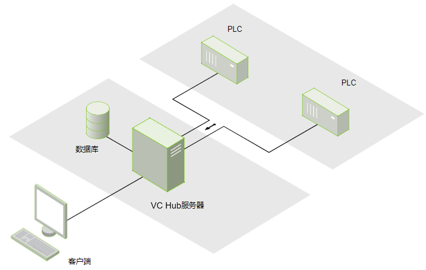
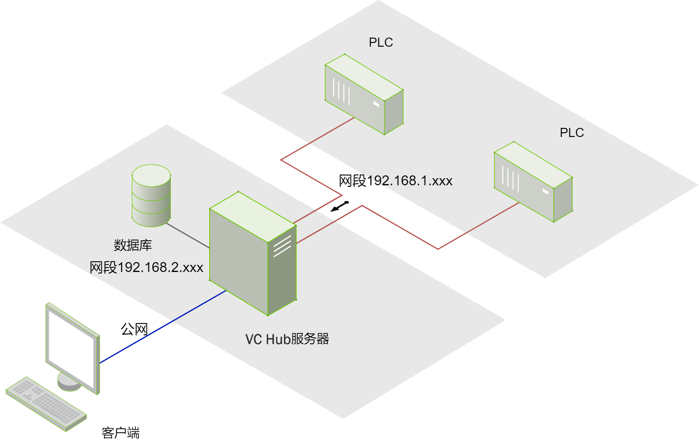

# 单机部署

单机部署是WAGO VC Hub的最基础的部署方式。单机部署的配置非常简单，其他更加复杂的部署方式也是基于单机部署而来的。

单机部署是指将WAGO VC Hub部署在一台服务器上，该WAGO VC Hub节点可以连接多个 PLC、OPC UA服务器和数据库。单机部署的VC Hub可以使用内置的SQLite数据库存储历史数据，也可以连接到其他数据库服务器，并将历史数据存储到其他数据库中。同时，该服务器允许任意多个客户端进行远程访问。

#### 多网络支持

WAGO VC Hub支持多网卡服务器，并可充当多个网络之间的桥梁，或通过企业广域网与多个站点进行通信。由于客户端通过WAGO VC Hub与数据库和可编程逻辑控制器（PLCs）通信，因此客户端可以从企业网络和隔离的控制网络启动，并提供对两者的完全访问。内置的安全设置可以通过限制项目中的某些内容或根据用户角色和网络位置拒绝对整个项目的访问，限制项目访问仅限于不同网络上的用户。

!

  

  

  

 
 

